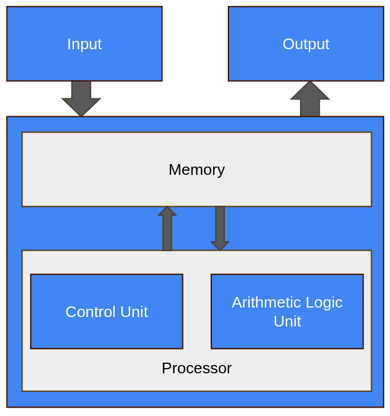
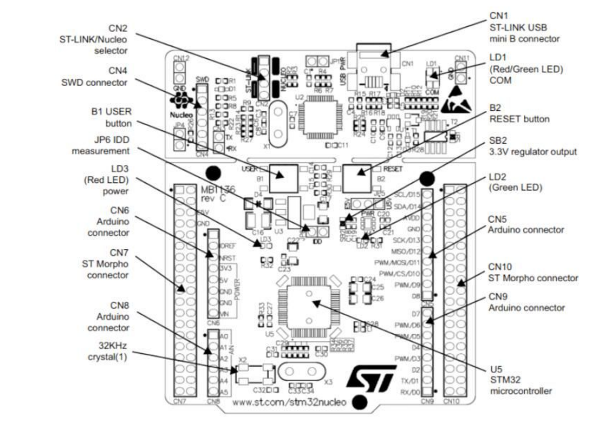
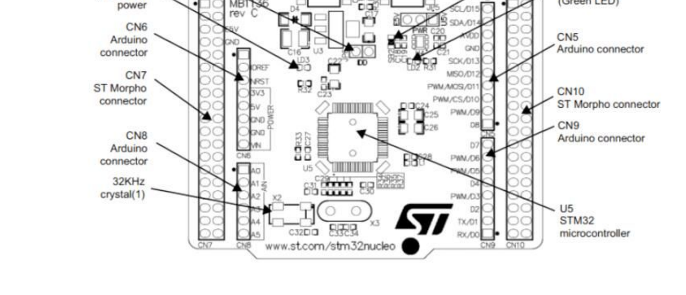

## Learning Objectives

In this chapter we will learn:

-   What an embedded system is

-   What is a microcontroller

-   Why embed a computer

-   What constraints do embedded systems have

-   What is a development board?

## What is an Embedded System?

An embedded system refers to a digital computer that is… embedded into another system! Think about all the devices you interact with daily that have been “digitized” by the inclusion of a small computer integrated into them to provide some sort of control or automation. Did you make coffee this morning with a coffee maker that automatically poured the perfect amount of coffee for your cup? Did you drive to work in a car that had a “push-to-start” button? Did you wash your clothes this week with a washing machine that knew how long to run each wash cycle based on the load size? These are all examples of systems that can automate many tasks due to their embedded computer!

On the other hand, what is not an embedded system? An embedded system is integrated into another device to provide some sort of control or automation. A computer that we use for general computing purposes, such as a laptop computer, would not be considered an embedded system.

A great rule of thumb for determining whether a computer is an embedded system or not, is to consider what is the purpose of the computer. If the device contains a computer, but is purchased or sold for some functionality other than computation, then it is an embedded system. If the device is purchased or sold because the product *is* a computer, then it is not an embedded system. For example, if you bought a coffee maker that has an embedded computer, do you care how much memory it has or how fast the processor is? However, when you bought your latest smartphone, did you exam the specifications of that device (e.g., processor speed, memory size, storage capacity)?

## Embedded Systems and Microcontrollers

The subject of embedded systems is A **microcontroller** is a device that contains an entire computer on a single chip, making it very easy to integrate with other systems. How are we able to fit an entire computer onto a single chip? Given the perspective of viewing a computer as something powerful like a laptop or desktop, this concept might feel a little far-fetched, but keep in mind we don’t need our coffee maker to run “photoshop”.

Because of the limited needs of the application, the computer might not need very many resources, allowing it to be stripped of any excess memory and processing power and shrunk down to a very small size, perfect for integration. Many microcontrollers will have memory on the scale of Megabytes while your laptop is easily on the Gigabyte scale. Microcontrollers come in a variety of different specifications - and it is up to the engineer to select the one most appropriate for the system in which it’s being embedded, based on processing power, memory, and input/output demands.

**Circuit board containing microcontrollers**

![Example microcontroller in embedded application (disassembled Furby electronic toy) [1]](../images/ch01/image10.jpeg){#fig-ch01-1-1}

## Microcontrollers vs. Microprocessors

The term “microcontroller” may sound familiar to you, due to its similarity to the term “microprocessor”. A microprocessor is the “brain” of a computer, such as the AMD or Intel processors found in a laptop or desktop computer. Microprocessors are often quite powerful, especially when contrasted with the computational power of most microcontrollers, but they themselves are not an entire computer.

To understand what constitutes a computer, let’s take a look at the five basic components of a Von-Neuman computer, which is the architecture of most modern computers:

{#fig-ch01-1-2}

In Figure 1.2, we can identify four major components:

-   Memory

-   Processor

    -   Arithmetic Logic Unit

    -   Control Unit

-   Input

-   Output

The memory is responsible for holding the computer’s information, such as the instructions comprising the programs and any data currently in use. The arithmetic logic unit (ALU) is capable of performing computations on the data, such as addition, subtraction, etc. The control unit reads instructions and directs the ALU to perform the appropriate action. Together, the control unit and the ALU form the processor. The input collects data from the outside, such as through a keyboard or mouse, and the output can display information, such as a monitor, or perhaps even manipulate something, like printing a page on a printer.

The ALU and control unit are often bundled together and called the “processor”. These two components are what comprise the microprocessor as well! As we can see here, the microprocessor is only two out of five components necessary for making an entire computer. The microcontroller actually contains all five of these components, but often in a more limited capacity than your laptop.

## Why Embed a Computer?

Embedding a computer into another system can bring many advantages. Since computers can be programmed to create a variety of behaviors, they can replace the need for engineers to design a custom circuit to perform specific tasks. Say an engineer is tasked with creating a circuit that will blink a warning light on a car’s dashboard with a one second interval. This would usually require a custom circuit with a specific timer and clock frequency, but rather than design this circuit, the computer can be integrated and programmed to blink this light. Not only would it be capable of handling this task, but many others at the same time. This is a simple example, but microcontrollers can also imitate the behavior of much more complex circuits as well.

Embedding computer to avoid having engineers create custom circuits cuts down on a product’s non-recurring engineering (NRE) cost. This is the cost of paying an engineer to create a new custom design. The engineer will still have to program the microcontroller, but this is generally easier than building and testing a custom-designed circuit.

Microcontrollers also help reduce the cost of a design because they are a generic component. The same microcontroller can be integrated into many different systems and be programmed for very different tasks. Microcontrollers will be manufactured on a scale that makes them extremely affordable, often costing less than 25 cent per chip. Even though the microcontroller’s design may be far more complex than a custom circuit for a specific task, its mass manufacturing still makes it the more cost-effective option.

Microcontrollers can also bring more advantages than just expense. In the same space any other circuit would occupy, a microcontroller can implement additional capabilities. This could be additional features beyond the base functionality of the device, such as safety features – both for the operator and the electronics themselves. This is because we are implementing features through software rather than hardware, which doesn’t require more physical space!

## An Example of Embedding Computers

As an example, let’s examine how embedded systems have affected automobiles. A typical modern car has dozens of microcontrollers embedded within it. Let’s see why.

Consider the windows of a typical car door. Often, they are controlled by a motor and a button is used to control lowering and raising them. The motor that controls these windows could be driven by a simple switch, but including a microcontroller allows us to create additional features. Using only a switch we could run into trouble when the windows are fully closed, but the motor continues to run as the window presses against the frame. This could cause the motor to stall, pulling more current than it should, which could in turn damage the circuit. With a microcontroller, we can read the button press through a program, then in turn drive the motor. Moreover, we could read some feedback from the motor in terms of an encoder – which could indicate when the motor has moved an appropriate distance to fully close the window – or we could include a current sensor – which could be used to programmatically shut off the motor controls when the stall current is detected.

In addition to electronic safety features, we can also add child locks on the windows in the back passenger seats of the car. By networking the microcontroller with other microcontrollers in the vehicle, the driver may engage some safety lock feature which would digitally communicate to the other microcontrollers to disable the ability to roll the windows down.

## Limitations of Embedded Systems

While we have observed many benefits that can come from embedded systems, such as cost reductions and automation, there are also many limitations that must be considered when designing for them. It was mentioned earlier that embedded systems are not as powerful as the microprocessors found in your laptop computer, and therefore their computing power and other resources are limited. This must be kept in mind when selecting the embedded system appropriate for the application.

If limited resources are such a concern, why not use a microcontroller with more memory and processing power than what’s required for the application? There are two reasons for this: cost and power consumption. Cost is the more obvious of the two – more resources, which equals more hardware, which equals higher cost. This cost may only increase the microcontroller’s cost by a few cents, but when the product that is utilizing the microcontroller is being manufactured on the scale of thousands to millions of units, these pennies begin to add up. Power consumptions is another major concern. More memory means more hardware components that require power, and faster processors have a higher clock frequency, which means more transistors switching, which means higher power consumption. Embedded systems often find themselves at home in battery-operated mobile devices, therefore keeping the power consumption low is of upmost importance to ensure battery life is elongated as much as possible. Have you ever purchased one device, such as a smartphone or laptop, over another because one had a longer battery life?

Embedded systems are also sometimes limited by their input and output capabilities. Most embedded systems come with some features that allow them to produce digital signals, read analog voltages, and communicate with other devices using serial protocols. These features can vary from microcontroller to microcontroller, so one must be selected that contains the necessary interfacing hardware, cost, and computational resources. It is the embedded systems engineer’s responsibility to select the correct microcontroller based on the project’s demands for these criteria.

## Developing for Embedded Systems

When developing for an embedded system, the design must first go through a prototyping phase to verify functionality. This prototyping phase usually involves breadboarding the circuit that will integrate the selected microcontroller, and the microcontroller will often be interfaced through a **development board**.

Development boards are prototyping boards that contain a microcontroller and onboard tools and components that aid in development and testing. These components often include the following:

-   Voltage regulation

-   Programmer circuit

-   Debugger

-   Breakout header pins

-   Push buttons and LEDs

These components often appear on development boards because they are commonly needed by programmers to power the board, upload code, and test inputs and outputs.

Let’s look at an example development board, the STM32 Nucleo-F091RC. This board has a lot going on, but what is most important is the chip at the center of the board, the STM32F091RC. This is the microcontroller, and all the other components here are to help with programming and testing of this chip.

{#fig-ch01-1-3}

The top half of the board contains the “ST-LINK” debugger circuitry. A debugger allows us to meticulously examine our microcontroller’s code behavior by setting breakpoints and stepping through the code line by line, while simultaneously being able to check memory contents. If this doesn’t make much sense right now, don’t worry, we will be elaborating on this again later in the book. This portion of the board also provides power regulation, which provides power to the microcontroller at a specific voltage. This part of the board also provides a virtual serial port connection from the microcontroller to your laptop or desktop computer, allowing communication between the two.

On the lower half of the board, beyond the jumper isolation block, we have the socket for the microcontroller, along with some extra connected components.

Arguably, the most important addition here is the inclusion of “breakout” pins. Breakout pins are pins that are large and spaced out, designed to be easily connected to jumper wires for interfacing with a prototyping circuit. The pins on a typical microcontroller package are much too small to attempt to plug or solder wires directly into, so the development board contains traces (wires embedded into the board) that connect these tiny package pins to the breakout pins.

{#fig-ch01-1-4}

In addition to the breakout pins, development board very commonly include components such as buttons and LEDs, as they are very often used in prototyping scenarios for easy getting user input via a button press or indicating the status of something through illuminating an LED.

Separating the top “half” from the bottom, we see a “jumper isolation block”, labeled CN2 (the “ST-LINK/Nucleo selector”) in @fig-ch01-1-3. These jumpers bridge electrical connections between the debugger circuit and the microcontroller. These bridged connections allow power and communications to reach the lower part. However, if we were planning on someday building a custom circuit using the STM32F091RC, we wouldn’t be including a debugger/programmer, since we wouldn’t expect the person purchasing the embedded product, the “end user”, to reprogram the device. These jumpers allow us to disconnect the microcontroller and test the chip without the support of that circuit, emulating what it might behave like before we create a custom board.

## Recap

An embedded system is an application-specific computer system which is built into a larger system or device. Using a computer system enables improved performance, more functions and features, lower cost, and greater dependability. With embedded computer systems, manufacturers can add sophisticated control and monitoring to devices and other systems, while leveraging the low-cost microcontrollers running custom software.

## References

1. P.-L. Ageneau, "Chaplier Fou," Aug. 25, 2023. [Online]. Available: <https://chapelierfou.org/blog/a-usb-furby.html>
