## Learning Objectives

This chapter will serve as a C programming refresher, or a to-the-point introduction for those who have programmed in other languages but are using C for the first time. In this chapter we will provide the motivation for using C, the basic syntax, how C works with computer memory, and how to use the STM32CubeIDE to develop C programs for STM32 microcontrollers.

In this chapter we will learn:

-   The differences between low- and high-level languages

-   Assembly language and machine code

-   C Programming basics

-   C and memory management

## Programming embedded systems

Like any computer, embedded systems must be programmed before they can do anything. Before we get into how we program them, let’s step back and define just what a program is. Because we use computers every day, I’m sure we all have an intuitive idea what a program is. What modern operating systems have come to refer to as an “App” may come to mind, or maybe you think of a video game, or a text editor like Microsoft Word. While these are all programs, a program by definition is much more simplistic than any of these. A program is a set of instructions stored in memory to be executed by the processor.

This definition begs the question, what is an instruction? An instruction is some simple operation that a computer can do. This can be an arithmetic operation, like add two numbers together; something logistical like compare two numbers; or even skip some other instructions based on a condition. Each of these operations is defined by the processor’s **instruction set architecture** (ISA). The ISA specifies a list of all operations the processor is capable of and how those instructions are formatted.

Let’s take a look at an example of one of these instructions.

```asm
ADDS R5, R5, #10
```

This instruction adds 10 to the value stored in a memory location R5 and saves the result back to that location. R5 refers to a memory location inside a small memory component called the register file. This instruction could be used to compute a simple mathematical expression, such as

```c
x = x + 10
```

Where x would be stored in the register file memory location, R5. We will see that when writing programs, we will often refer to the computer’s memory components, such as the aforementioned register file. While memory can have many intricacies, for now let’s just understand that memory in general has many locations for holding data, all indexed by a number that we call the **address**. In this example, R5 represents the address of a memory location (location 5) in the register file.

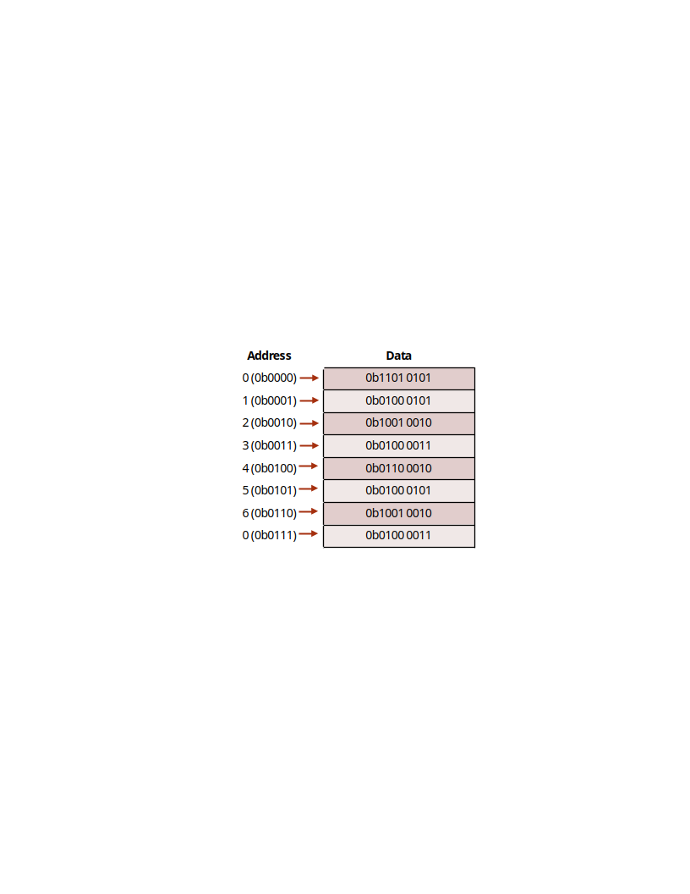{#fig-ch02-2-1}

These instructions are presented in a way that we, as the programmers, can understand them. Hence why instructions, such as “ADD”, are presented in English. Naturally, they are translated into **machine code**, or the binary 1’s and 0’s that a computer understands by the use of a program called a **compiler**. The language that we just saw is what we call **assembly language**, which directly corresponds to the machine code produced by the compiler.

In our previous example, we were able to add a number (10) to an existing number (the data stored in R5). Let’s consider another example, but this time let’s specify a mathematical operation we want our computer to perform:

```c
x = x + 10 + 15 + 20 + 25
```

Now we want to sum up a variety of numbers. How would we write a program that does this? Assuming that x corresponds to register file location R5, we could write:

```asm
ADDS R5, R5, #10
ADDS R5, R5, #15
ADDS R5, R5, #20
ADDS R5, R5, #25
```

And this will perform this operation. This series of instructions, or program, starts from the top instruction and performs each operation sequentially. Computers perform one instruction after the other, and we can see by the time we reach the last line, we would have computed the result of the equation described earlier. One observation that can be made even this early, is as the application’s complexity increases, so do the number of instructions. You can imagine that writing in assembly language would be very laborious for programmers creating complex applications such as Microsoft Windows. To assist with this problem, other programming languages have been created, such as C.

To implement the equation described earlier in C, we would simply type:

```c
x = x + 10 + 15 + 20 + 25;
```

Which looks nearly identical to the equation itself! While the computer in the end would have to perform the same operations we saw in assembly, describing this in C is much simpler on the programmer’s part. The compiler will then be responsible for interpreting this line of C code into the associated assembly instructions, and from there into the computer’s native machine code. Because of the added step of going to assembly and then to machine code, we classify C as a “**high-level**” programming language. High-level refers to how distanced the lines of code are from the machine code instructions that would be required to execute them. In contrast, assembly language would be considered a “**low-level**” language.

## Why Program in C?

This question might seem obvious at first, simply because the complexity of C seems lesser compared to our earlier example, which is largely still true. The one drawback to using C and other high-level languages is the efficiency. We’ve now taken full control of writing the individual instructions that comprise our program and handed it over to the compiler. A compiler may not be as skilled at interpreting the high level instructions into low level instructions, resulting in a less efficient and larger program.

This is the trade-off that exists with any high-level language: the further from the individual instruction the language is, the less efficient it tends to be. However, this trade off is nearly worth it every single time, as it would be too challenging to write modern programs directly in assembly. Not only would getting these programs written would be challenging, but the number of bugs (accidental, unintentional program behaviors) as a result of the complexity would be great.

### Portent Portables

Writing programs in C does bring with it some other advantages, most notably: portability. We’ve mentioned assembly language and ISA, but we did not mention that each type of processor has its own specific ISA, and therefore a different set of instructions that they are capable of executing. The assembly language understood by the processor in your laptop computer is likely very different from the one in your smartphone. Therefore, programs written in assembly for one machine cannot be moved an executed on a different machine that has a different ISA. The C language however must be interpreted into assembly by the compiler before being interpreted to machine code. Therefore, if a compiler exists for each target machine, the C code can be rebuilt for each machine. This makes the C language more generic, and therefore more portable.

### Why Not Program in C++?

If you’re already familiar with programming, you may be familiar with the C++ language. C++ is a language derived from C, adding in many new features used by programmers to organize code. These features include a concept called a “class”, which allows programmers to group related functions and data together, making it what we refer to as an **object-oriented** language.

While these features are attractive from the programmer’s point of view, they also cause the language to be even further distanced from the instruction level than C. Because of this, C++ programs don’t compile as efficiently as most C programs do. This typically is too much of a tradeoff, as microcontrollers still have limited amounts of memory, and cannot store very large programs. C++ is graining traction in the world of embedded systems development, especially as many modern microcontrollers have more memory than ever before, but still C rules supreme. There are also historical reasons for this as well, as many older projects active in both hobbyist and industry spaces, are still ongoing and originally written in C.

### Beyond C -- Other Languages in Embedded Systems

While C remains dominant, other languages are gaining interest for embedded development:

-   **Rust**

    -   Memory-safe without a garbage collector

    -   Prevents many bugs common in C (e.g., buffer overflows)

    -   Still emerging in embedded space due to:

        -   Limited ecosystem and tooling

        -   Steeper learning curve

        -   Smaller community and fewer drivers/libraries

-   **Python / MicroPython / CircuitPython**

    -   Easy to learn and use

    -   Great for rapid prototyping and educational use

    -   Limited to higher-end MCUs due to:

        -   Large interpreter overhead

        -   Slow performance and high memory use

## Introduction to C

In this section we’ll get familiar with the basic syntax of the C language. A language’s **syntax** refers to the structure and keywords that exist within that language. Keywords or reserved words are words that are recognized by the compiler that have some explicit meaning or function. Let’s begin by analyzing an example of a simple C program:

```c
#include <stdio.h>
int main(){
    // print hello world to terminal
    printf("Hello World!");
    return 0;
}
```

This is a simple program that prints the message, “Hello World!”, to the standard output, which if ran on a traditional laptop or desktop computer, would be some terminal application.

\<show hello world terminal screenshot\>

The first thing to point out about any C application is that the program begins with the **main** function. We’ll define functions in C more formally later on, but for right now, know that lines of code that follow main and are contained within the curly braces are the instructions that come next.

In this example, we have only two lines of C code. One is another function call, “printf()”, and the other is “return 0”. An individual line of C code is easy to identify, because each line ends with a semicolon. This tells the compiler when a single line of a C program is finished and ready to be interpreted into the resulting assembly instructions. The “printf” function will write to the output whatever text is placed within the parenthesis that follow it. The return keyword ends the current execution of instructions within the function, therefore terminating our program and passing a 0 back to the operating system that called it. This 0 is typically a code that indicates that everything executed okay.

At the very top of the code we see an additional line, which reads: ”#include \<stdio.h\>”. This is an example of a preprocessor macro. The **preprocessor** is a part of the compilation process that runs before the compiler does. It processes any lines that begin with a “#” symbol and in this case is used to retrieve additional code to add to our program. This additional code is referred to as a **library**, and it gives us access to the “printf” function. Libraries are a handy way to provide other programmers prebuilt functionality, so you do not have to re-write everything from scratch.

We also skipped over the line that began with “//”. The double backslashes indicate a comment. A comment is a note left to add context or a message. These are usually left to remind the programmer what a complex series of instructions might be doing, or to explain something to another programmer who also is developing in this code base but didn’t write a certain portion of the code. Comments may also encapsulate multiple lines using the “/\*” and “\*/” syntax:

```c
/*
Comments here
Comment here
And here. All on different lines!
*/
```

Comments are ignored by the compiler and do not add to the overall code size.

## Creating Variables

If we wish to write our own programs, we need to be able to store data. Like many other programming languages, C uses variables to achieve this. Variables look just like a variable in a mathematical expression, and function in a similar way. A variable represents a location in the computer’s memory that has been reserved to hold data.

In C, variables must be given a type. The type determines what kind of data will be stored in that variable. Let’s look at an example of how one might declare a variable:

```c
int main(){
    int x;
    return 0;
}
```

In this example, we’ve declared a variable called “x” and it has been designated to hold an integer by preceding our variable name with the keyword “int”. There are many different data types in C, but we’ll examine some of the basic types here:

| Data Type | Description |
|----|----|
| `int` | holds only integer numbers |
| `float` | holds decimal point numbers |
| `char` | used to hold values that correspond to characters in the ASCII table |
| `bool` | used to hold true or false values. Short for “Boolean” |

These variables can all be used in different scenarios depending on the need of the data type.

### Operators

Now that we’re able to reserve memory locations to hold our data in the form of a variable, we need operators to be able to actually do things with the data. There are many operators in C, but we’ll start with the most simple, the assignment operator, “=”, which allows us to write data to a variable. Let’s modify our earlier example to assign a value of 5 to our variable x we declared:

```c
int main(){
    int x = 5;
    return 0;
}
```

Now after reserving the space for variable x, the value 5 will be written to that location. There are many more operators available in C, so let’s have a look at all the different types available.

\<Add initialized vs uninitialized junk here\>

#### Arithmetic Operators

Arithmetic operators are used to perform arithmetic operations, such as addition, subtractions, etc. These operations require variables or values to perform the operation with, and a destination variable to write the result. Let’s see an example of the addition operator:

```c
int main(){
    int x = 5;
    int r = x + 10;
    return 0;
}
```

We’ve expanded our earlier example by adding an additional variable, r, which hold the result of our addition operation, which adds 10 to the value stored in x, 5. After this operation, r will hold the value, 15. There are many arithmetic operators in C, here are some of the most common:

| Operator | Description |
|----|----|
| `+` | performs addition |
| `-` | performs subtraction |
| `*` | performs multiplication |
| `/` | performs division |

#### Boolean Operators

In addition to arithmetic operators, we also have a set of Boolean operators. Boolean operators are operations that do not have a numerical result, but rather a true/false result. Boolean operators are used to compare two numbers for properties such as equality, greater than, etc.

| Operator | Description |
|----|----|
| `x == y` | used to compare two values for equality |
| `x != y` | used to compare two values for inequality |
| `x > y` | used to evaluate greater than |
| `x < y` | used to evaluate less than |

\<side note: are adding variables (x,y) more or less confusing?\>

## Branching and Loops

Boolean operators are often used in conjunction with branching and loops within a C program. Branching refers to performing different actions based on a condition, and looping allows us to re-run lines of code over and over. These structures give us the ability to make decisions within a program.

### If Conditions

“If” conditions are the essential branching method in C. An “If” condition will run a specified group of instructions based on a Boolean condition. Let’s take a look at an example:

```c
int main(){
    int x = 5;
    int r = 0;
    if( x > 2){
        r = x + 10;
    }
    return 0;
}
```

Here we see the keyword, “if”, followed by parenthesis. Within these parenthesis, a Boolean expression is described. If the Boolean expression resolves as true, the lines of code contained within the following parenthesis will be executed. Otherwise, it will be skipped and execution will continue.

If conditions can also be expanded upon by adding additional conditions and an “else” condition that resolves when any of the preceding conditions are not true. An example of this is demonstrated in the code below:

```c
int main(){
    int x = 5;
    int r = 0;
    if( x > 2){
        r = x + 10;
    } else if(x > 5) {
        r = x + 15;
    } else {
        x = r + 5;
    }
    return 0;
}
```

### While Loops

In addition to conditional branches, programmers often have the need to repeat certain lines of code. The “while” loop serves this function by repeating grouped lines of code so long as its Boolean condition resolves as true:

```c
int x = 0;
while ( x < 5){
    x = x + 1;
}
```

In this while loop, the body of the loop (the lines of code encapsulated by the curly braces) will execute five times, terminating once x reaches 5, as the condition will no longer evaluate as true. The condition of a while loop is evaluated prior to executing the body, so if x had already been greater than 5, the body of the loop would not execute even once.

If there is a need to execute a body of code once, THEN check the condition, a do-while loop may be used:

```c
int x = 5;
do {
    x = x + 1;
} while ( x < 5);
```

Here, the body of the loop will be ran BEFORE checking the condition.

### For Loops

While all of our looping needs can be satisfied by the while loop, another type of loop exists as a shortcut for common looping conditions: the for loop. It is very common that programmers might want a loop to execute for a certain number of iterations. To achieve this, a while loop can be constructed and a counting variable might be used, similar to how the variable x behaved in our while loop example earlier. A for loop incorporates a counting variable into its syntax, allowing easy control over how many times a loop iterates.

```c
int i;
for(i = 0; i < n; i++){
    // body of the loop goes here
}
```

The for loop header is composed of three parts: initialization, condition, and increment/decrement. We can see here that in the parenthesis that follow the keyword “for”, the variable i is initialized to 0. This is followed by the condition, i \< n, which like in the while loop, tells the body when to stop looping. The last part is the increment/decrement, where the variable is incremented by one (++ is the c shortcut for adding 1 to a variable). Each part is separated by a semicolon.

## Functions

Functions are the main source of organization in the C language. Functions allow us to group lines of code and invoke them at various points in our program. Let’s consider and example and discuss the syntax:

```c
float circleArea(float radius){
    float area;
    area = radius * radius* 3.14;
    return area;
}
```

This is a function that computes the area of a circle given a radius value. The beginning of the function has three parts: the return value, the name, and the parameters.

The return value is what the result of the function is; for a circle that computes the area of a circle, we expect a decimal point value as the result, so our return value is simply indicated by a “float”.

The function name is “circleArea”. This part is not a keyword, and can be named whatever we want. We’ve chosen a name that is indicative of the function’s purpose.

The parameters are the values that are passed to the function. Functions can have one, many, or no values passed to them. The parameters are contained within the parenthesis and contain a data type and a variable name. The values passed to a function are copied from their original locations, and these variables will only exist between the curly braces that contain the body of the function.

Now that we’ve discussed the format of a function, we can revisit our main function we saw in the “Hello World” example:

```c
int main(){
    // print hello world to terminal
    printf("Hello World!");
    return 0;
}
```

We can see how main follows the same structure as our other function example. We’ll note that main takes 0 parameters and returns an integer. The main function is called by the operating system if on a desktop or laptop computer, and the integer it returns encodes an error value. While functions can be named anything, main is an exception, as the compiled program will start at the function called main.

### Scope

As mentioned before, variables declared within a function are not accessible outside of that function, and they only exist in memory so long as that function is still be executed. This limited availability of a variable is what we refer to as the variable’s “scope”.

Let’s consider an example using the area function earlier:

```c
float circleArea(float radius){
    float area;
    area = radius * radius* 3.14;
    return area;
}
int main(){
    float r = 5;
    float area = circleArea(r);
    …
```

Here, the variables “r” and “area” within “main” are only accessible within the main function’s curly braces. The function “circleArea” is called within main, so main’s variables do not get removed from memory yet, but are not accessible within the “circleArea” function. We can observe that circleArea has two variables within its scope, “area” and “radius”. The “radius” variable is populated with a copy of the data contained in “r” when the function is called. We also notice that our variable “area” shares a name with the “area” variable from main. Variables must have unique names so long as they are in the same scope, but here, since these “area” variables are only available within their respective functions, this isn’t a problem and they are both easily differentiated from each other due to their scope. This kind of scope is what we call a **local scope**, as theirs scopes are local to the functions where they were declared.

We can also bypass the local scope of a variable by declaring a variable outside of the functions.

```c
float area = 0;
void circleArea(float radius){
    area = radius * radius* 3.14;
}
int main(){
    float r = 5;
    area = circleArea(r);
    …
```

Here, “area” has been moved and declared outside of both functions, giving it a **global scope**. Global variables are scoped to all functions that exist within the same C source code file. By making “area” global, we no longer have to create multiple local variables and return the area from the function.

This may seem like a convenient shortcut, but when projects become large, this scales poorly and overuse of global variables can result in wasted memory and very difficult to trace bugs.

### Function Prototypes

In the examples we just saw, all of our functions were defined above the main function, and this was no coincident. In C, source files are compiled from the top-down, which means if a function is called before the compiler has processed that the function exists (“circleArea”, for example), it won’t be able to perform the compilation, and will throw and error. As files grow larger, programmers often wish to place main() closer to the top of the file, given the importance of main and understanding how a program behaves. However, we need some way to do this without breaking compilation.

Function prototypes exist to remedy this issue. A function prototype is a line of code that alerts the compiler of the existence of a function, what parameters it takes, and what it returns; but excludes the implementation. Let’s use our example from earlier, but instead we’ll place main() above circleArea()’s implementation:

```c
#include <stdio.h>
float circleArea(float radius);
int main(){
    float r = 5;
    float area = circleArea(r);
    printf("Area: %f", area);
    return 0;
}
float circleArea(float radius){
    float area;
    area = radius * radius* 3.14;
    return area;
}
```

Now circleArea() has a prototype that resides at the top of the file, and the implementation of the function exists below main. This prototype will be encountered by the compiler before the call to it in main(). When a function call is compiled, the compiler doesn’t need to know what the function does, just what needs to be passed to and returned from the function. Since the compiler knows what “circleArea()” is, it can finish the compilation, just so long as it eventually finds an implementation that pairs with the function prototype. If it doesn’t, then the code will fail to compile.

## Arrays and Structs

We’ve discussed the basic data types of the C language, but often we need more than a single value to represent different concepts or a collection of values.

### Arrays

Arrays are used to maintain a contiguous sequence of data in memory.

Let’s look at an example of an array:

```c
int a[5] = {4, 6, 2, 8, 0};
```

Here, the array is declared following the data type it holds like any other variable, but the defining line of syntax is the angle brackets that follow the name. Within the angle brackets the number of elements contained within the array is defined. Here, the compiler makes space in memory for five integers one after another. Following those brackets, the array has been initialized with some values to fill the five elements specified. These are contained within the curly braces and separated by commas. In this case, the “5” within the angle brackets could be removed, as the initialized list of elements is implicit of the size of the array.

Each element in “a” is accessed by an “index”, which begins at 0. For example:

```c
int r = a[0] + 10;
```

This code accesses the first element of the array which exists at index 0. The last element of the array exists at index 4. An array in C is a very simple structure, as the array itself only maintains the position in memory where the array begins, and just counts the requested index worth of space away from that starting position. Arrays have no way of knowing how large they are, as they are just given the requested amount of space when they are declared. Because of this, programmers must be careful, because the following code will compile with valid syntax for our current example:

```c
a[9001] = 74;
```

This is clearly outside of the number of elements the compiler created for us, but to the computer it just wants to access the memory location that is 9001 integers away from the start of the array. This can result in the computer attempting to read from an invalid memory address.

### Structs

Structs are a way to group related variables in C. For instance, we might want to maintain an x, y point in 2-D space. I could declare two separate float variables for x and y, but then I need to keep track of them together throughout the rest of the code, and it might not be immediately clear to other programmers that they are a pair. To resolve this issue, a struct can be used:

```c
struct point {
    float x;
    float y;
};
```

This defines a structure called point, and this can be used as if it where a new datatype. For instance, I can declare an instance of my struct and assign values to x and y as follows:

```c
struct point p;
p.x = 2;
p.y = 3;
```

We can see here that I declared the struct using “struct point” followed by a name for the variable, “p”. I then accessed and assigned the members of that struct, x and y, using the “.” Syntax. This operator allows me to access the variable contained within the specified structure. The variables within a struct can be used like any other variable after being accessed through the “.” operator.

Here is a more complete example, using a struct to represent a 2-D point and compute the distance between two points:

```c
#include <stdio.h>
#include <math.h>
// Define a struct for a 2D point
struct Point {
    int x;
    int y;
};
int main() {
    // Declare two points
    struct Point p1, p2;
    // Initialize the first point
    p1.x = 3;
    p1.y = 4;
    // Initialize the second point
    p2.x = -1;
    p2.y = 2;
    // Calculate the distance between the two points
    double distance = sqrt((p2.x - p1.x) * (p2.x - p1.x) + (p2.y - p1.y) * (p2.y - p1.y));
    // Print the coordinates of the points and the distance between them
    printf("First Point: (%d, %d)\n", p1.x, p1.y);
    printf("Second Point: (%d, %d)\n", p2.x, p2.y);
    printf("Distance between the points: %.2f\n", distance);
    return 0;
}
```

### The Typedef Keyword

Having to precede every instance of our struct's name with the "struct" keyword can be tedious. To avoid repeating "struct" every time we declare a variable of this type, we can use the `typedef` keyword to define our struct as a new data type.

`typedef` is used to specify a new name for a data type. It requires the following pattern:

```c
typedef <thing that is a new type> <name of new type>;
```

We can apply this to our point struct by combining the definition of the struct itself with a typedef, giving the resulting type a name directly:

```c
#include <stdio.h>
#include <math.h>
// Define a struct for a 2D point
typedef struct {
    int x;
    int y;
} Point;
int main() {
    // Declare two points
    Point p1, p2;
    // Initialize the first point
    p1.x = 3;
    p1.y = 4;
    // Initialize the second point
    p2.x = -1;
    p2.y = 2;
    // Calculate the distance between the two points
    double distance = sqrt((p2.x - p1.x) * (p2.x - p1.x) + (p2.y - p1.y) * (p2.y - p1.y));
    // Print the coordinates of the points and the distance between them
    printf("First Point: (%d, %d)\n", p1.x, p1.y);
    printf("Second Point: (%d, %d)\n", p2.x, p2.y);
    printf("Distance between the points: %.2f\n", distance);
    return 0;
}
```

Notice that we can now declare variables of type “Point” directly, without needing to write “struct Point” each time.

## Pointers

Pointers are one of the most confusing and unique aspects of both C and C++ programming. A pointer is a variable that holds the memory address of another variable, thus causing them to “point” to another variable. While confusing in nature, this allows specific control and access of memory locations, which we will see is very important for microcontroller programming. Many languages try to hide this aspect of programming from the programmer, as mismanagement of pointers can lead to some very serious bugs.

Let’s see an example of a pointer:

```c
int* p;
```

From this, we can see that pointers are declared like any other variable. What makes the declaration different is the addition of the asterisk following the data type. This is what defined the variable as a pointer, by indicating what type of data the pointer will hold the address. In this case, variable “p” will hold the address of another integer variable.

So to actually use the pointer, we need another variable to point to.

```c
int* p;
int x = 5;
p = &x;
```

Now we’ve added an integer variable x, and used a new operator, “&”, which extracts the address from the variable it precedes. This takes the address of x and stores it in p. Now, I can use “p” to manipulate “x” through the memory address it holds.

```c
*p = 10;
```

This line of code assigns the value 10 to the variable “x”. This is done by use of the asterisk that precedes “p”. This is called “**dereferencing**” the pointer variable, which means that we follow the pointer back to the memory address it holds and use the variable that exists there. This allows us to both read and write that’s variables data.

\<Create visual reference for what’s happening in memory here\>

### Pointers and Functions

So far we’ve introduced pointer syntax, but how is it useful? In C, one of the most valuable usages of a pointer is to allow other functions to utilize a variable that is out of scope. Instead of passing a variable to a function, which results in a copy being made, we can pass a pointer to variable, which allows a function to make permanent changes to a variable outside of its scope. For example, we can write:

```c
void swap(int* x, int * y){
    int temp = *x;
    *x = *y;
    *y = temp;
}
```

This function will permanently switch the values of the integers passed to this function as pointers.

```c
int main(){
    int a = 1;
    int b = 2;
    swap(&a, &b);
```

In this example, we called swap by using “&” to get the addresses of “a” and “b” to pass to the function. The function dereferences those pointers to make changes to variables “a” and “b”, which aren’t normally accessible by “swap”. After the swap function is called, the value of “a” is 2 and the value of “b” is 1.

### Pointers and Arrays

Arrays have a unique relationship with pointers as well. Earlier, we mentioned that arrays only retain the location in memory where the array begins. Because of this, we can use the name of the array as a pointer. For example:

```c
int a[] = {1, 2, 3, 4}
int* p = a;
```

Here, I can use “a” to assign integer pointer, “p”, as the name of the array refers to the address where the array begins. Because of this relationship, we can then pass pointers to arrays to other functions to modify the original location of an array, just as we did with other variables. The important thing to observe here is the absence of the & operator. Since the name of the array already refers to the address, we do not have to & prior to extract the address.

### Strings

When writing programs, especially any that display information to a user, we are interested in storing entire words and sentences. Earlier we introduced the char data type, which was used to store individual characters.

```c
char c = 'A';
```

However, we need to be able to store a group of characters to form words or sentences. This is where the concept of a string comes in. A **string** refers to an array of characters ending with a null character.

```c
char s[] = {'H', 'e', 'l', 'l', 'o', '\0'};
```

This array is a string that holds the word “Hello”. Note that the last element contains ‘\\0’, which represents the null character. A null character is used to indicate the end of a string, and is essential when attempting to determine where a string ends, as arrays do not know how long they are. By including a null character at the end, we can create loops that iterate through a string and stop when they encounter ‘\\0’ as that indicates the end of the string has been reached.

## Variable Sizes in Embedded Systems

One question that might come to mind is why differentiate between data types? If you think about it, you should be able to do everything with a “float”. Decimal point numbers can represent integers, we could use them to hold corresponding character values as well, and even use them to represent true and false by designating a certain value to represent “true”. The answer comes down to speed and efficiency. Binary can naturally represent integer values, but it requires a special format to represent decimal numbers. Floating point numbers are also difficult to process and require special hardware. Floats also take up more memory than chars or bools, and depending on the machine, “int”s as well. Therefore, we define other data types for faster processing and better use of the limited memory available on our microprocessor.

\<Add example here of two programs producing variables of different sizes\>

To this end, C defines even more varieties of data types that give use even more control over the amount of memory reserved for each data type.

| Data Type | Description |
|----|----|
| `short` | an integer that uses even less memory space than int, but holds smaller numbers |
| `long` | an integer that uses more memory space than int, but holds larger numbers |
| `double` | a decimal point number that uses more memory than float, but holds larger numbers |

### Modifiers and Qualifiers

We also might want to be able to further control the data types and how they’re used, and to aid with this, C allows us to specify modifiers and qualifiers for our data types.

#### Modifiers

Some common modifiers are:

-   `long`

-   `short`

-   `unsigned`

-   `signed`

These modifiers can be used in conjunction with most basic data types. For instance, I can declare:

```c
long int x;
```

Which makes an integer that on most desktop machines holds 64 bits rather than 32 bits. I can also use the “short” modifier to make a 16-bit integer. Other modifiers can determine whether a variable is treated as having negative values or not:

```c
unsigned int x;
```

This prevents “x” from being treated as though it has a negative value. From a numerical perspective, this allows a greater range of positive values, as we no longer have to dedicate the sign bit to representing negatives. This modifier is used a lot in microcontroller programming, as we are often modifying data that exists in memory locations where each bit’s value is important, and the numerical value of the data isn’t of interest. This will be contextualized in the following chapter.

#### Qualifiers

C also supports type qualifiers. Qualifiers specify how the variable can be used within a program. Some common qualifiers include:

-   const

-   static

-   volatile

The const qualifier specifies the value of a variable is constant. This means after the variable has been assigned a value, it cannot be changed. This is useful for defining actual mathematical constants in our program, such as pi:

```c
const float PI = 3.14;
```

While you could hard-code 3.14 everywhere in memory where you wanted to use pi, this enhances the readability of the code. It can also be useful for values that serve as thresholds that may need to be adjusted throughout a program’s development.

The static keyword allows a variable to hold its value even after going out of scope. This allows functions to essentially have their own variable that retains its memory between function calls.

```c
int increment(){
    static int x = 0;
    x = x + 1;
    return x;
}
```

In this example, the first call to the function will return 1, then the following call will return 2, as the initialization of the static variable, “x”, only occurs on the first call, and it retains its data between subsequent calls.

The volatile qualifier is especially relevant for embedded systems as we will see in coming chapters. The volatile keyword forces the compiler to explicitly build all instructions that the variable is involved in. Sometimes the compiler will attempt to analyze and optimize C code as it translates it into assembly, and because of this process, it may exclude some operations that it evaluates as unnecessary. The volatile keyword prevents this from happening, and forces all of its operations to be built.

## C Programming Conventions

As programs grow larger and are worked on by more than one person, following good conventions becomes just as important as understanding the syntax itself. One common convention worth adopting early is avoiding "magic" numbers.

### Avoiding "Magic" Numbers

A "magic" number is any number that is hard coded into a line of code with no context and is specific to that application. This could be something like a threshold value or a count value.

While these numbers are necessary, you can avoid making them "magic" numbers by either using a `#define` macro or a `const` variable:

-   This will provide a name for the number, which will make it easy to read and provide context.

-   If the number needs to change, it will only need to be changed where it is defined, rather than in every line of code using the number.

-   These numbers should be formatted in `ALL_CAPS_SNAKE_CASE`.

Consider this C program that prints the area of a circle to the terminal:

```c
#include <stdio.h>
int main(void){
    // Compute area of circle and print to terminal
    printf("area: %f", 3.14 * 2.0 * 2.0);
    return 0;
}
```

The values `3.14` and `2.0` are magic numbers -- a reader has no way of knowing at a glance that `3.14` represents pi or that `2.0` represents a radius. Removing the magic numbers gives us:

```c
#include <stdio.h>
#define RADIUS 2.0
#define PI     3.14
int main(void){
    // Compute area of circle and print to terminal
    printf("area: %f", PI*RADIUS*RADIUS);
    return 0;
}
```

This version is both easier to read and easier to maintain, since the radius or the precision of pi used only need to be changed in one place.

## Variables and Memory

When programming microcontrollers in C, it is especially important for the programmer to be aware of how their code is affecting the use of memory, especially since this tends to be a limited resource. Depending on where a variable is declared within the lifetime of a program, it may be stored in a different location and exist for either a limited amount of time or for the duration of the program.

### Memory Map

Memory in a computer is generally divided up into different regions, each with a specific purpose. diagram below shows the most common memory regions. The diagram below shows these regions. The order and address ranges of these regions may differ between microcontroller architectures, or even include additional memory regions, but across all architectures the ones presented here will be present.

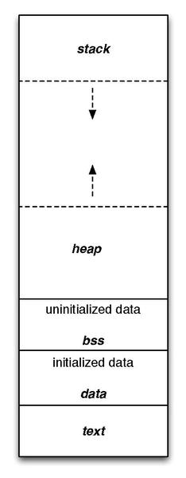{#fig-ch02-2-2}

These regions can be separated into two categories: **Read Only Memory (ROM)** and **Random Access Memory (RAM)**. Let’s take a look at the purpose of each of these regions and their respective category.

#### Text

The region labeled text is where the instructions from the compiled program are stored. Once a program has been compiled and loaded, these instructions cannot be changed, making this region ROM.

#### Data and BSS

The data and BSS regions hold global, static, and constant variables. If a variable is uninitialized or initialized to 0, it is stored in the BSS regions. Otherwise, it gets stored in the data region. These regions can be manipulated at runtime, making it a form of RAM.

#### Stack

The stack is where local variables are stored, and it behaves in a first-in, last-out fashion, like a stack of items in real life. Local variables are automatically placed on the stack when they are created, giving them the name, “**automatic**” variables. In most architectures, the stack grows from larger address towards lower addresses. The nature of the stack means that it must exist in RAM.

#### Heap

The heap is where dynamically allocated variables are stored. These are variables created at runtime by other instructions and are not stored in the stack. The programmer determines the lifespan of these variables by having to be manually responsible for their creation and deletion. The heap grows in the opposite direction of the stack, to best utilize the range of memory allocated for both of these structures. Like the stack, this region is also considered RAM.

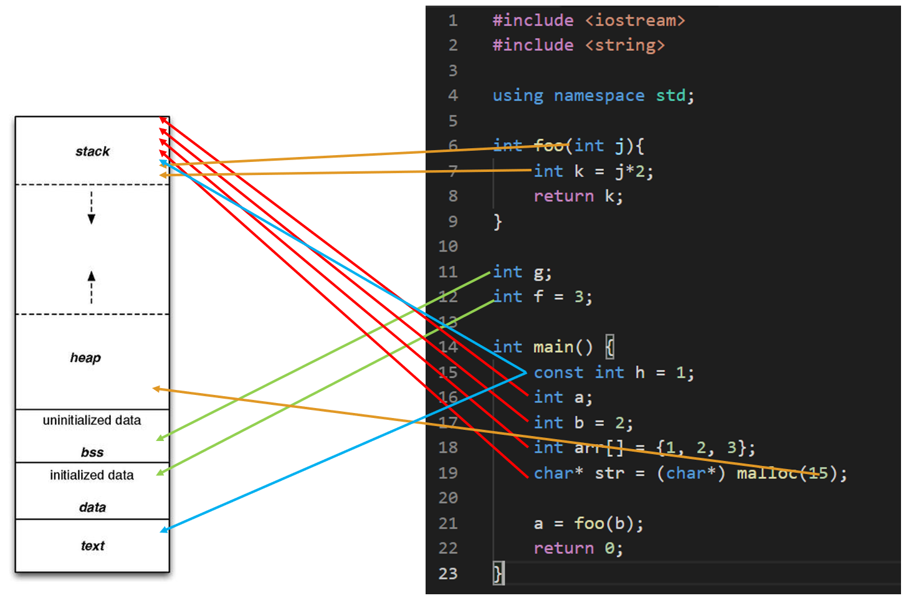{#fig-ch02-2-3}

### Advanced Considerations: Memory Behavior

#### Instructions and the Text Region

The text region contains the individual instructions that comprise the compiled program. These instructions are the binary representation of the Arm Thumb instruction set used by the STM32F091RC (a Cortex-M0 microcontroller). @fig-ch02-2-4 shows how a compiled C line of code could be represented by a set of assembly instructions. Here, a single line of multiple addition operations would result in multiple assembly addition instructions.

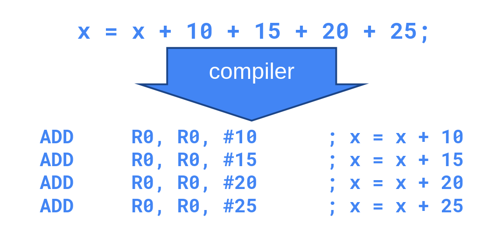{#fig-ch02-2-4}

These instructions are then placed in the text region and read out and executed by the processor in a linear sequence. The processor has a special register called the “Program Counter” (PC) that tracks the memory location of the current instruction being read. As the program is executed, the program counter will increment to the memory location of the next instruction.

For example, to execute the example code in @fig-ch02-2-5, the program counter would start at address 0x08000100 to read out the instruction “ADDS R5, #10”. Since the current instruction requires 2 bytes (all Thumb instructions on the Cortex-M0 are 16 bits wide), the next instruction is 2 bytes away from the current instruction address, so 2 will be added to the program counter’s value. The program counter would then read out the instruction “ADDS R5, #15”. The process will then continue. The program counter will simply increment to the next instruction unless a branching condition, such as an if statement or a function call, would cause the program counter to jump to another location in code.

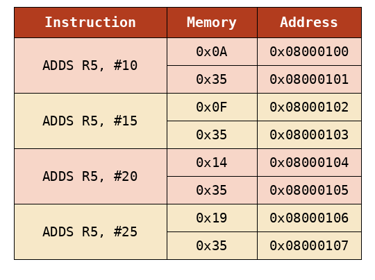{#fig-ch02-2-5}

#### Stack Behavior

All variables that are declared inside of a function (with some exceptions, such as const and static variables), are stored within the stack. The stack functions in a way that is intuitive to its naming: variables are piled up on top of each other in memory – growing from high addresses to lower addresses. For a simple C program, we might see stack contents similar to the diagram in @fig-ch02-2-6.

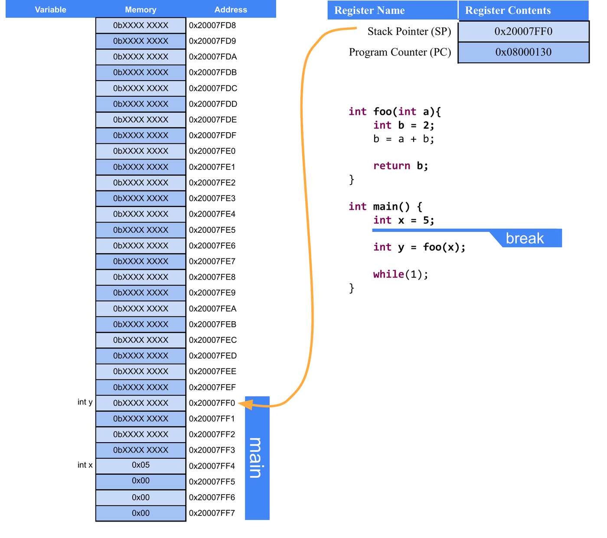{#fig-ch02-2-6}

Note that in @fig-ch02-2-6 the compiler has created space on the stack to hold all of the local variables within main. Since the code is paused before the call to the “foo” function, the contents of variable “y” are still uninitialized; only space on the stack has been allocated for “y” to exist – the contents of “y” are unknown at this time, as they are whatever bit values happened to be in that memory location prior to allocation of space for “y”.

We can also observe the memory contents for each variable in this figure. Note that “x” is allocated 4 memory locations, as integers require 32 bits on the STM32F091RC (an Arm Cortex-M0 processor, which is a 32-bit architecture), and memory is addressed in 8-bit segments. If we used 32 bits to represent 5 in binary, it would look like “0000 0000 0000 0000 0000 0000 0000 0101”. But if we look at the memory location used to hold “x”, we see the least significant byte, “0000 0101” comes before the rest of the zero bytes. This is because the Arm architecture (as configured on the STM32) is “little endian”, which refers to the order that data is broken up into when stored in memory. “Little endian” means the least significant byte goes in the lowest memory address. This contrasts with “big endian”, which would store the bytes in reverse. The order bytes are stored in memory is architecture-specific, but ultimately has no consequence on the device performance and is an arbitrary decision.

Each function in C is given its own “stack frame” when called. We can see that in @fig-ch02-2-6 where a contiguous section in memory is carved out for all of “main’s” variables. If we let the program break at a point in “foo”, we’ll see another stack frame created for the “foo” function, as illustrated in @fig-ch02-2-7.

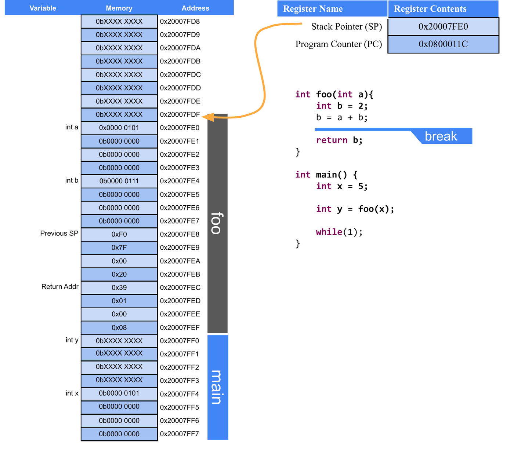{#fig-ch02-2-7}

In this figure we can see the “foo” stack frame stacked on top of the “main” stack frame. Note that the stack frame of “foo” contains all of the local variables (including input parameters) along with a “return address”. The return address is used to indicate where in the instruction memory to return to once the “foo” function concludes. We can note between @fig-ch02-2-6 and @fig-ch02-2-7, the return address in @fig-ch02-2-7 is 4 bytes greater than the value of the Program Counter in @fig-ch02-2-6, which makes sense as the next instruction is a few bytes away from the instruction that called “foo”, and, once “foo” is complete, we should call the next instruction after “main” would have called “foo”.

### Dynamic Memory Allocation in C

Utilizing the heap in a C program can be a very tricky thing, and if handled improperly, can lead to memory leaks, which are very dangerous to an embedded system. Dynamic memory allocation refers to utilization of the heap to store data which will not be subject to the behavior of the stack. The stack is constantly growing and shrinking, and functions are called and completed. Sometimes we have a need to maintain data for a limited period of time but might need to exist for a time longer than the call of a function. This is where the heap comes in.

In the heap, we can specify that space for a particular data type, array, or structure may be allocated. The space is then made, and we are returned the address to that space. That space can then be used like any other variable; however, it is then our responsibility to deallocate that space when we are finished using it. If we do not deallocate it, then that memory will be locked out for the rest of the program’s life span. If we continue using the heap and never freeing up the memory when we are finished, this leads to a **memory leak**. If this process continues over time, the heap will grow so large that it consumes too much of the memory range it shares with the stack and will begin overwriting it, resulting in all sorts of undesirable behaviors.

#### Malloc

To allocate space in the heap, we use the function “malloc”, which comes from the stdlib library. Malloc is short for memory allocation. This function will reserve a specified number of bytes in the heap and return a pointer to that space. We can then manipulate the data reserved by malloc by dereferencing the pointer it returns. Let’s look at an example:

```c
char* p = malloc(1);
```

This call to malloc reserves a single byte, which is the size of a character on all architectures. Malloc returns a void pointer (a pointer that doesn’t point to any specific data type) and assign it to a character pointer, as a character pointer will point to a single byte. The type of pointer we assign the space to indicates how that space will be used as well.

It might be a bit strange to allocate space for a single character, so let’s use malloc to allocate space for an entire string containing 6 characters (including the null character):

```c
char* s = malloc(6);
```

We can then populate this string like we would any other array. Recall that the name of an array can be used interchangeably with the name of an array:

```c
s[0] = 'H';
s[1] = 'e';
s[2] = 'l';
s[3] = 'l';
s[4] = 'o';
s[5] = '\0';
```

This has been very straightforward so far when it comes to malloc, as we’ve just indicated how many bytes we need to allocate and get the pointer to that space. However, this has been simple because each char only requires one byte. For instance, a float would require 4 bytes worth of space, so if we were allocating space for an array of floats, we would have to allocate 4 \* n, where n would be the number of elements in the float array we wanted to create.

We could manually specify the number of bytes required, but this can lead to miscalculations and a lack of code portability as the data sizes may change between microcontroller C compilers. In order to write the most dependable malloc function call, we will utilize the sizeof function. Sizeof returns the number of bytes for the data type passed to it. Therefore, to use malloc to allocate a float array of size n we would write:

```c
float* a = malloc(n * sizeof(float));
```

#### Free

After we are done using the space we created with malloc, it is then our responsibility to free that memory back up so that it may be allocated at a later time for different purposes. To do this, we simply call the function “free” and pass it the pointer to the allocated space. To free up our float array allocated previously, we would write:

```c
free(a);
```

Now all data allocated in the heap at the address stored in “a” would be available to be reallocated. Failure to do so would result in potential memory leaks.

## C Build Process

Now we’ve discussed the basic syntax of the C language, let’s look into how we convert that syntax into an executable that can be ran on a computer. We’ve already introduced the tool responsible for this conversion, the compiler. The compiler reads the C source files and ultimately converts it into an executable file which contains the 1’s and 0’s of the architecture’s instructions. However, the Compiler is actually composed of many different applications, each with a specific responsibility. We’ve already introduced some of these, such as the preprocessor, but here we’ll see where they all exist within the compilation process.

The four main steps of the compilation process are as follows:

1.  Preprocessor

2.  Compiler

3.  Assembler

4.  Linker

Let’s take a look at each stage’s responsibilities in detail.

### Preprocessor

The preprocessor runs before any of the other steps and is responsible for all lines of code that are preceded with the “#” symbol. These lines of code are called “**macros**” and are eliminated and replaced by C syntax in some way before the preprocessor passes the processed source code to the compiler. Preprocessor macros can be used to add constant values to locations in the C source code by using commands such as “#define” or used to add entire header files through “#include”.

Let’s consider an example of the preprocessor’s effects on a C source file. Let’s say I have the following C source files:

**[main.c]{.underline}**

```c
#include "circle.h"
int main(){
    float r = 3.5;
    float area = circleArea(r);
    return 0;
}
```

**[circle.h]{.underline}**

```c
#define PI 3.14
float circleArea(float r);
```

**[circle.c]{.underline}**

```c
#include "circle.h"
float circleArea(float r){
    return PI*r*r;
}
```

Here we have a file called “main.c”, which contains my main function (the file containing the main function is usually named “main” by convention). I have another c source file called “circle.c”, which contains a function for computing the area of a circle. I also have a shared header file, “circle.h”, which contains the function prototype for the area function and a definition for the value of PI. When compiling, each “.c” file gets compiled separately, so the preprocessor will be ran for both “main.c” and “circle.c”. Let’s see what these files look like after the preprocessor has run:

**[main.c]{.underline}**

```c
float circleArea(float r);
int main(){
    float r = 3.5;
    float area = circleArea(r);
    return 0;
}
```

**[circle.c]{.underline}**

```c
float circleArea(float r);
float circleArea(float r){
    return 3.14*r*r;
}
```

What we observe here is that the function prototype for the area has been appended to the top of each file, and anywhere the label “PI” was found, it was replaced by its defined value, 3.14. In this example, that was only a single location in the circleArea() function. Now that all the preprocessor macros have been resolved, the code is ready to be sent to the compiler.

### The Compiler

The compiler is responsible for interpreting the C source code into its assembly language equivalent. We haven’t gone into the details of assembly, and we won’t in this book, but let’s take a look at what the compiler will do to each of our files. Note that the “.c” extension will be replaced with “.s” for each respective assembly file, as “.s” is the typical assembly file extension:

**[main.s]{.underline}**

```c
main:
    push    {r7, lr}
    sub     sp, sp, #8
    add     r7, sp, #0
    ldr     r3, .L7
    str     r3, [r7, #4]
    ldr     r3, [r7, #4]
    adds    r0, r3, #0
    bl      circleArea
    adds    r3, r0, #0
    str     r3, [r7]
    movs    r3, #0
    movs    r0, r3
    mov     sp, r7
    add     sp, sp, #8
    pop     {r7, pc}
```

**[circle.s]{.underline}**

```c
circleArea:
    push    {r7, lr}
    sub     sp, sp, #8
    add     r7, sp, #0
    str     r0, [r7, #4]
    ldr     r1, .L3
    ldr     r0, [r7, #4]
    bl      __aeabi_fmul
    adds    r3, r0, #0
    ldr     r1, [r7, #4]
    adds    r0, r3, #0
    bl      __aeabi_fmul
    adds    r3, r0, #0
    adds    r0, r3, #0
    mov     sp, r7
    add     sp, sp, #8
    pop     {r7, pc}
```

Despite circleArea() being a small function in C, the resulting assembly is not trivial. This is due to the fact that it uses floating-point operations. The Cortex-M0 core in the STM32F091RC does not include a hardware floating-point unit, so the compiler must instead call a software floating-point routine, `__aeabi_fmul`, to perform each multiplication. Therefore, programmers prefer integer operations, when possible, as they are considerably smaller and easier for the processor to handle from a performance perspective.

### The Assembler

The assembler takes the assembly files created by the compiler and converts them into object files. Object files are part machine code, part symbols. The symbols represent things that aren’t available in the source and must be resolved within other files, such as the implementation of the “circleArea()” function call in main. Main understands that “circleArea()” is a function with certain parameters because of the prototype that was included in the “circle.h” header file. Main will need to generate a symbol for that function so that it can be resolved in the next step: the linker. The location where the symbol will belong can be seen in the assembly code above for main; the line containing “bl circleArea“ will have a symbol to be linked for “circleArea”.

### The Linker

The linker’s job is to take all the object files, resolve the symbols, and create the executable. This is the stage where all unimplemented functions across all the object files will be tied to their appropriate definitions. Once the linker is completed, the executable file is produced, containing the machine code to be ran by the processor.

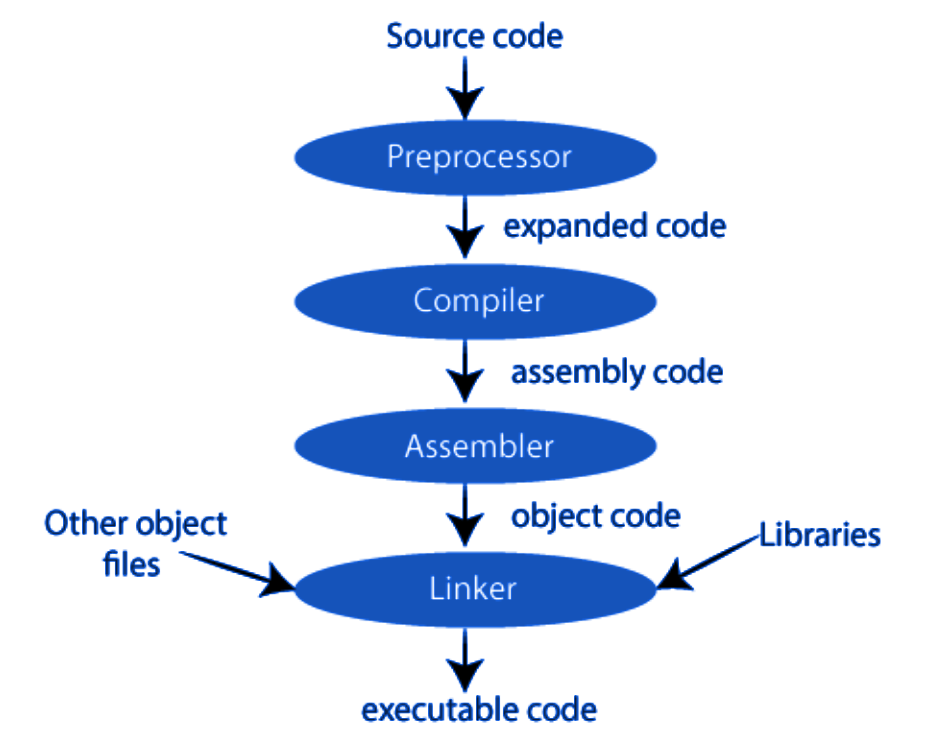{#fig-ch02-2-8}

### The Loader

A fourth step exists for embedded system applications, which is the loader. The loader is a tool responsible for placing the executable into the microcontroller’s memory. Small-scale microcontrollers often simply store their program in the text region of memory, and this region must be completely re-written when updating the code.

### Cross Compilers

We’ve explored the process of compilation, but there is one more important detail to acknowledge when it comes to building C programs for embedded systems, and that is the processor that is building the program and what processor the program is to be ran on. In typical software development, when writing applications to be ran on a desktop or laptop computer, the type of machine the code is being built on is also the same machine the code will be intended to be ran. Therefore, most compilers are made to build for the machine doing the building, but that is not the case for embedded systems.

When writing programs for microcontrollers, such as the STM32F091RC, we are writing and building the code on a desktop or laptop, which is most likely an x86 architecture, and running the code on an Arm architecture. Therefore, we need a special compiler known as a cross-compiler. A cross compiler will build code on one machine to be ran on a machine of a different architecture. The machine doing the building is known as the **host** machine, and the machine the program is built for is known as the **target** machine.

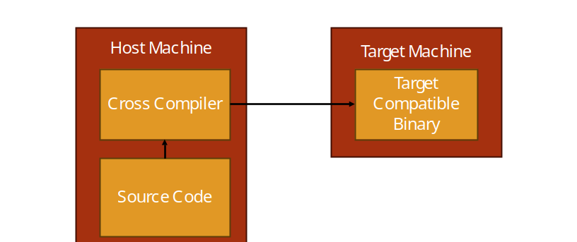{#fig-ch02-2-9}

## Integrated Development Environments

To aid with the complexity of running cross compilers, editing code, and the many other needs required for creating programs for embedded systems, programmers often use an **integrated development environment** (IDE). IDEs are applications which usually include a variety of tools to help with software development. For embedded systems, this typically includes the following:

-   Text Editor and Syntax Highlighter

-   Build Tools

-   Debugging Tools

Even more features may come in other IDEs, but for embedded systems these are the most common.

### STM32CubeIDE

When developing for the STM32F091RC, or any STM32 microcontroller, STM32CubeIDE is the free IDE provided by STMicroelectronics to support their products. STM32CubeIDE is built on the Eclipse C/C++ Development Tooling (CDT) platform and contains all the tools listed in the previous section, plus a few more, such as STM32CubeMX-based project and peripheral configuration, which can generate initialization code for a project based on the microcontroller and peripherals selected.

#### STM32CubeIDE UI Overview

Let’s take a look at the user interface (UI) of the STM32CubeIDE environment. We’ll start by highlighting the large section in the center of the window, the text editor. The locations of these windows shown here are the defaults, but they can be moved around per the user’s preferences. The text editor provides syntax highlighting and a space to edit the code. It also can support the addition of breakpoints, which when in debugging mode will allow the processor to stop execution at the line of code marked with a breakpoint and allow the user to inspect things such as memory content and variable values.

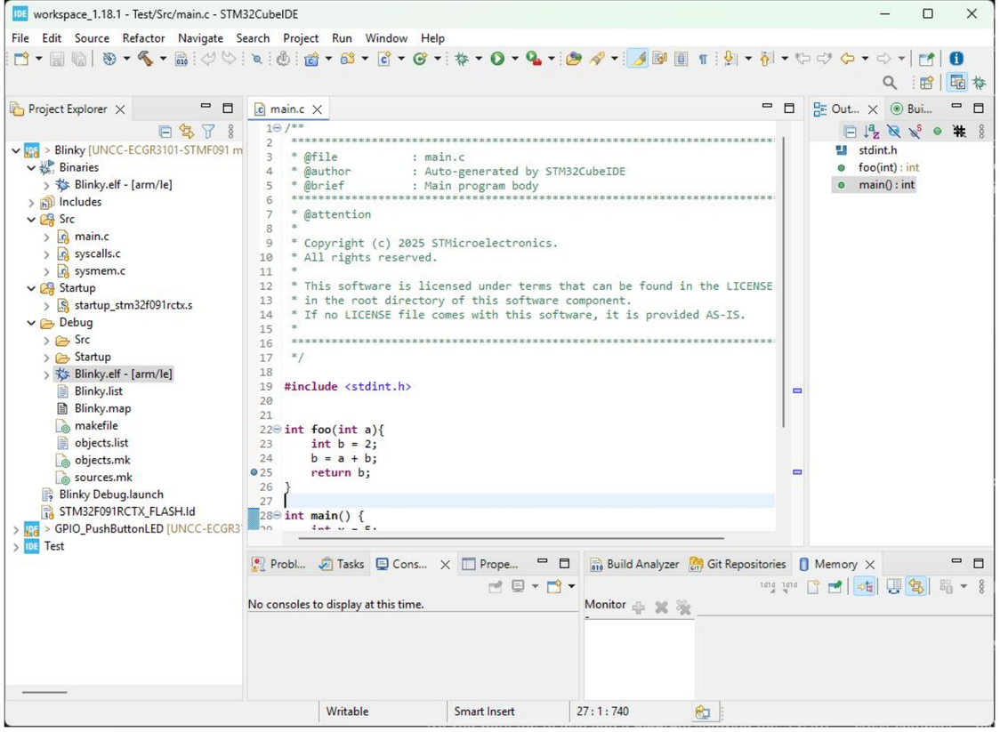{#fig-ch02-2-10}

On the left side you can see several directories with different items inside. This is the **Project Explorer** and it displays the contents of the workspace directory on your computer. The workspace directory is a location you specify where STM32CubeIDE will store your projects. A project is a collection of source files (.c, .h), startup code, linker scripts, and build configuration that tell the Arm cross compiler what microcontroller the project is building for and how to build it. By organizing everything into a project directory, a lot of the intricacies and complications of cross compilation is managed by STM32CubeIDE rather than the user having to remember all the details.

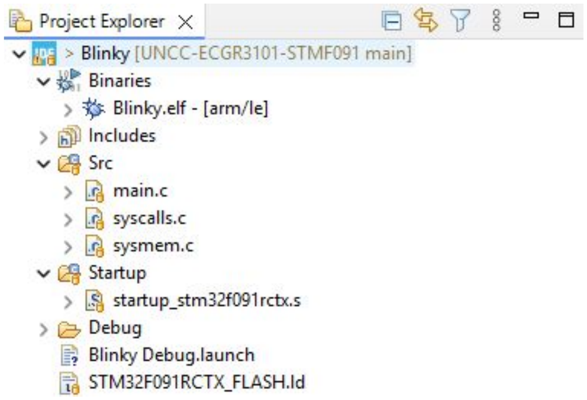{#fig-ch02-2-11}

A newly generated project's Project Explorer will typically contain the following folders:

-   **Drivers** – contains the CMSIS (Cortex Microcontroller Software Interface Standard) headers and the STM32 Hardware Abstraction Layer (HAL) library, which provides functions for configuring and using the microcontroller's peripherals.

-   **Startup** – contains the startup assembly file, responsible for initializing the stack pointer and calling `main` after a reset.

-   **Src** and **Inc** – contain the project's own application source (.c) and header (.h) files, including `main.c`.

On the top, we have the toolbar menu, which gives the user access to all of STM32CubeIDE’s features and tools. The toolbar has everything organized under the labels: file, edit, source, refactor, navigate, search, project, run, window, and help. There are a lot of features packed under these labels, but for convenience, several of the more common ones are broken out underneath with several icons to indicate their purpose. We’ll highlight the most basic ones here:

-   Hammer Icon – builds the active project

-   Bug Icon – builds the active project, uploads it to the target, and begins a debugging session

-   Play Button – continues the current debug session

-   Pause Button – pauses the current debug session

-   Stop Button – stops the current debug session

-   Step Into – steps into the next function or line of code in the debug session

-   Step Over – steps over the next instruction in the debug session

New projects for the STM32F091RC are typically started using STM32CubeMX (either as a standalone tool, or integrated directly within STM32CubeIDE). STM32CubeMX allows the user to select the target microcontroller (or development board, such as the Nucleo-F091RC), configure its clocks and peripherals through a graphical interface, and then generate the initialization code and project structure automatically -- rather than needing to hand-write the low-level register configuration for each peripheral, as would be required with just a bare compiler.

## Recap

In this chapter we have learned why we program embedded systems in C, the basic syntax of C, and how C variables related to memory in terms of bytes occupied and location. We also have been introduced to the generic computer memory map and what each region is used for and how it operates.
