## Learning Objectives

In this chapter we will learn:

-   What peripherals are

-   How to find and use microcontroller documentation

-   What General Purpose Input/Output is

-   How to control peripherals by writing to memory-mapped registers

-   The STM32 GPIO register set

-   Bit masking

## Interfacing with the Outside World

A microcontroller isn't very useful if it can't interface with the world around it. In order to read a button press, illuminate an LED, or communicate with another chip, the microcontroller needs specialized hardware built into it beyond the processor and memory we've discussed so far. This specialized hardware is referred to as a **peripheral**. A peripheral is a piece of hardware, separate from the processor core, that is included in the microcontroller to provide some additional capability, typically related to input or output.

The STM32F091RC, like most microcontrollers, includes many different peripherals, each specialized for a different task. Some peripherals produce or read digital voltages, some convert analog voltages to digital values (and vice versa), some keep track of time, and others communicate with external devices using a specific protocol. @fig-ch03-peripherals shows an illustration of some of the peripherals commonly found on a microcontroller.

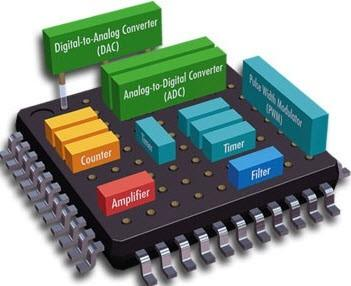{#fig-ch03-peripherals}

In this chapter, we will focus on the most fundamental of these peripherals: the **General-Purpose Input/Output** (GPIO) peripheral. Before we get into the specifics of GPIO, however, let's discuss where we will find the information necessary to use any peripheral on the STM32F091RC.

## Microcontroller Documentation

Nearly everything we do as embedded systems programmers requires us to consult documentation. Since a peripheral's behavior is dictated by hardware, and every microcontroller's hardware is designed a little differently, we cannot simply guess how to configure it. Instead, we must rely on documentation provided by the manufacturer, in our case, STMicroelectronics.

It's tempting to think of this documentation as a single document, but in practice, you'll find that manufacturers split their documentation into several different documents, each covering a different level of detail. For the STM32F091RC on our NUCLEO-F091RC development board, we will regularly reference three different kinds of documents:

-   Documentation specific to our development board (the NUCLEO-F091RC)

-   Documentation specific to our microcontroller family (the STM32F0 series)

-   Documentation specific to our exact microcontroller (the STM32F091RC)

Each of these documents serves a different purpose, and knowing which one to open for a given question will save you a lot of time.

### Development Board Documentation

The development board documentation describes the board itself, not the microcontroller. This document will help us identify the specifics of our particular development board, such as where the buttons and LEDs are connected, how the on-board debugger works, and the layout of the board's schematic. For our NUCLEO-F091RC, this information is found in ST's *UM1724* user manual, shown in @fig-ch03-doc-devboard.

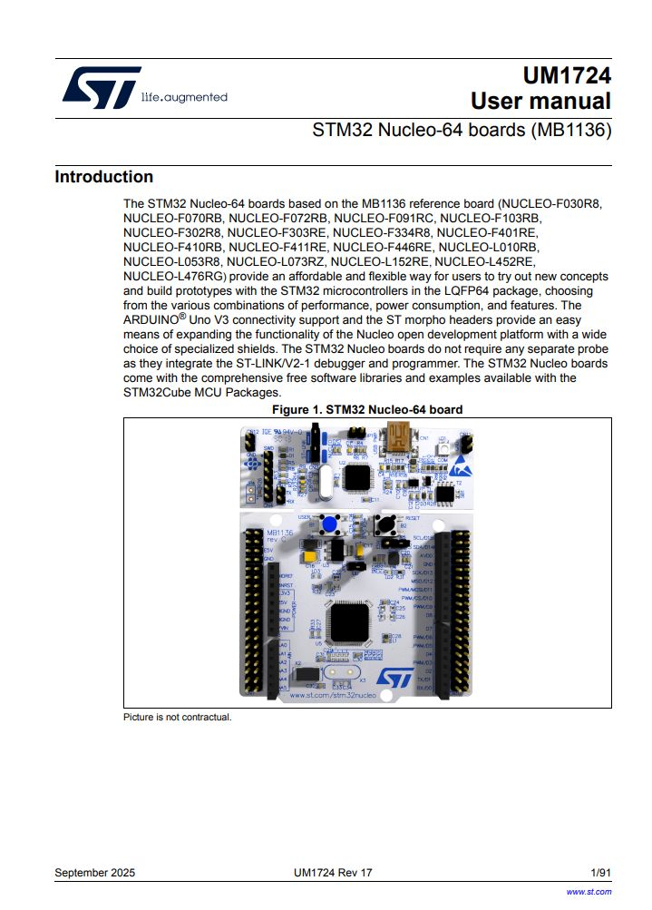{#fig-ch03-doc-devboard}

### Microcontroller Family Documentation

The microcontroller family documentation, more commonly called the **reference manual**, contains details that are common across an entire family of microcontrollers. This is usually the document we will reference the most while programming, as it contains detailed descriptions of each peripheral and its associated registers. For the STM32F091RC, this is ST's *RM0091* reference manual, shown in @fig-ch03-doc-refman, which covers the entire STM32F0x1/F0x2/F0x8 family of microcontrollers, of which the STM32F091RC is a member.

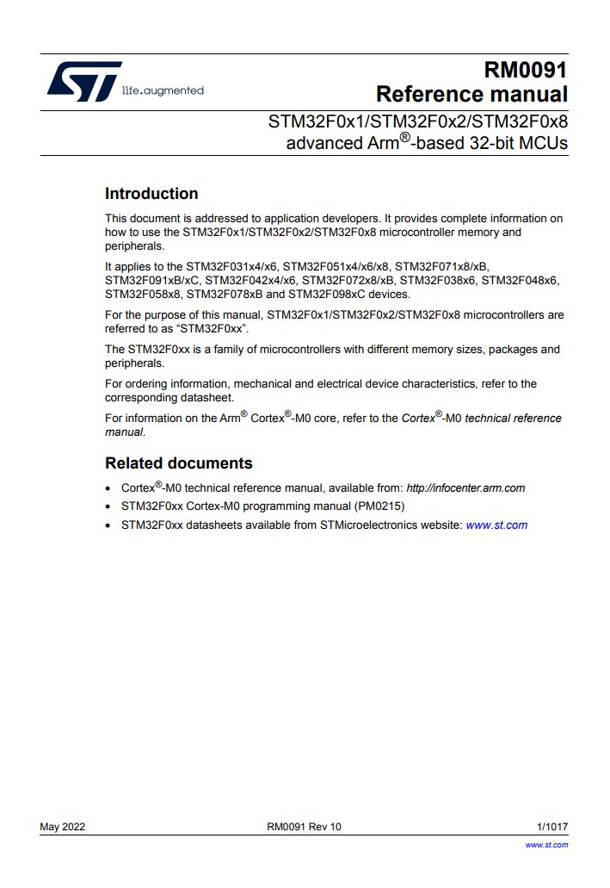{#fig-ch03-doc-refman}

### Microcontroller-Specific Documentation

Finally, the **datasheet** is the documentation most specific to our exact chip. This document typically contains mechanical drawings of the physical package, the pinout diagram, and electrical characteristics, such as the operating voltage range and current limits. For the STM32F091RC, this information can be found in the datasheet shown in @fig-ch03-doc-datasheet.

{#fig-ch03-doc-datasheet}

::: {.callout-note}
Throughout this chapter, we will regularly point out which of these three documents contains the information we're discussing, so you can get comfortable navigating between them.
:::

## General Purpose Input Output

Now that we know where to look for information, let's discuss the GPIO peripheral itself. The GPIO peripheral allows the microcontroller to read or set digital voltages on the pins of the chip. This gives us the ability to create some of the most fundamental forms of input and output, such as illuminating an LED or reading a button press.

Let's recall what is meant by a "digital" voltage. A digital voltage represents either a 1 or a 0. A 0 is typically represented by 0 volts, and a 1 is represented by the microcontroller's operating voltage. When speaking generally about these voltages, we use the terms **high** and **low** to refer to whatever voltage represents a 1 and 0 in the system, respectively. Voltages between these two extremes may be interpreted inconsistently by the microcontroller and should be avoided when working with GPIO.

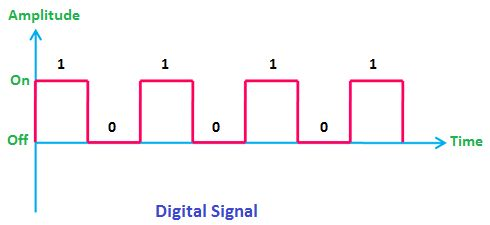{#fig-ch03-digital-signal}

### How to Find Operating Voltage

The operating voltage of a microcontroller is defined in its datasheet. The STM32F091RC typically operates within a range of 2.0 V to 3.6 V. The NUCLEO-F091RC development board is powered over USB, which supplies 5 V. This 5 V is regulated down to 3.3 V before being supplied to the microcontroller, so 3.3 V is the voltage we should expect to see representing a digital high on this board.

### Controlling an LED

Let's consider an example of illuminating an LED using a GPIO pin. Say we have a GPIO peripheral controlling a pin labeled "P1," which is connected to a small current-limiting resistor in series with an LED, which is then connected to ground, as shown in @fig-ch03-generic-led.

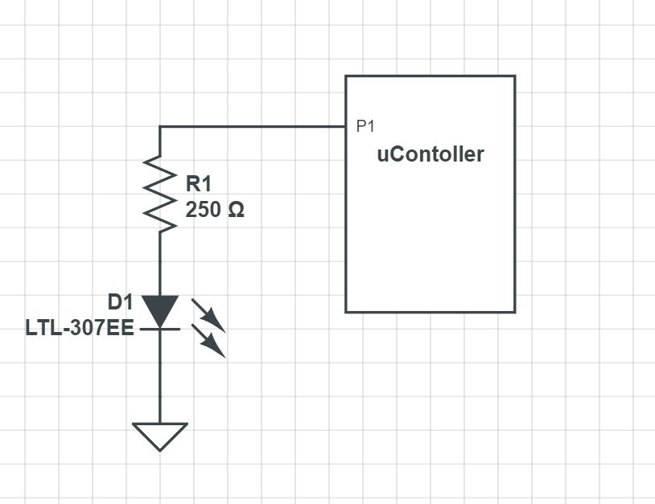{#fig-ch03-generic-led}

When the GPIO provides a high voltage on P1, current flows from P1, through the resistor, through the LED, and to ground, causing the LED to illuminate. When the GPIO writes a low voltage (0 V), there is no longer any electrical potential across the LED, since ground is also at 0 V. With no potential difference, no current flows, and the LED turns off.

### Reading a Button Press

Now let's consider reading a button press. To do this, we need a switch that can control whether a high or low voltage is presented to a GPIO input pin. We'll connect P1 to a resistor that is wired to a high voltage source, and also to a switch that connects the pin to ground, as shown in @fig-ch03-generic-switch.

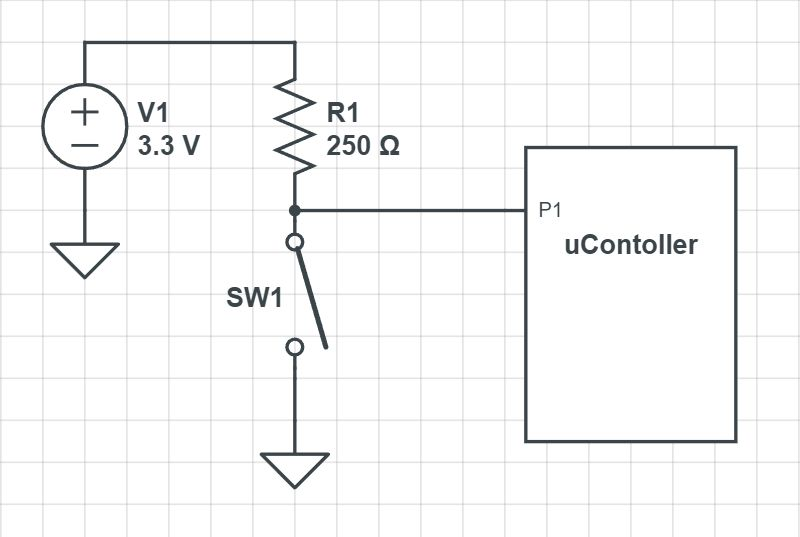{#fig-ch03-generic-switch}

When the switch is closed, P1 is directly connected to ground and reads 0 V; nearly all the voltage is dissipated across the resistor, and negligible current flows into the microcontroller. When the switch is open, there is no longer a direct path to ground, so current flows into P1 instead. Since the input of a GPIO pin has extremely high resistance, nearly all the voltage is dissipated across the microcontroller's input rather than the resistor, and P1 reads a high voltage.

We've now covered the two most fundamental input/output scenarios for an embedded system. Let's see how this is achieved on the STM32F091RC.

## Peripherals and the Memory Map

From the perspective of a single instruction, there are only two things a line of code can control: the operation performed (add, subtract, etc.) and the memory location where the result is written. In order for our program instructions to control a peripheral, that peripheral must therefore appear as a memory location so our instructions can write to it. Each peripheral contains many **control registers**, which behave like any other memory location, except that the values written to them dictate how the peripheral's hardware behaves. For GPIO, this might mean configuring whether a pin is an input or an output, writing a high or low voltage to a pin, or reading whether a pin currently holds a high or low voltage.

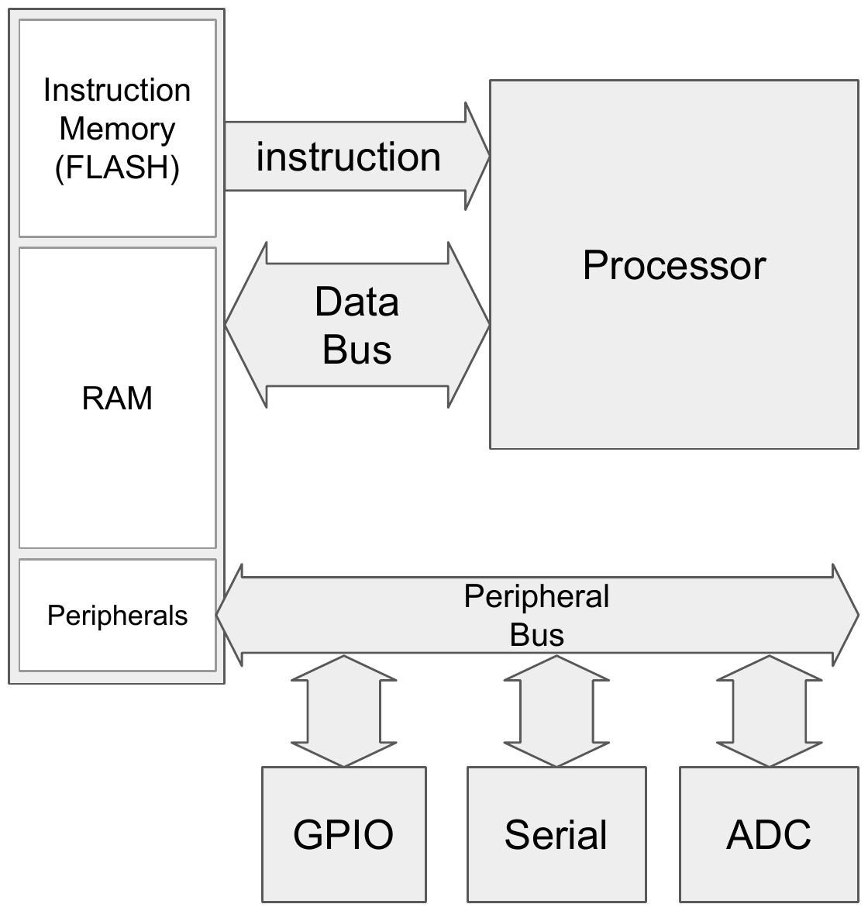{#fig-ch03-mem-mapped}

Since the only thing an instruction can interact with is memory, peripherals need to appear as memory! Specific memory addresses are wired directly to the peripheral hardware, so writing to those addresses controls entirely separate pieces of hardware, completely independent from RAM.

We can access these memory-mapped locations using a pointer. If we have a pointer that points to the memory address associated with a peripheral's register, we can dereference it to write data directly to that peripheral and control it.

```c
uint16_t value = 0x0010;
uint16_t* p = (uint16_t*) 0x48000014;
*p = value;
```

### The STM32F091 Memory Map

Each microcontroller has its own memory map, so to know where a peripheral's control registers reside, we consult the reference manual. @fig-ch03-memory-map shows the memory map for the STM32F091RC. The regions we're already familiar with, such as the stack, heap, and program instructions, are all found within the "CODE" and "SRAM" regions here. New regions, labeled APB, AHB1, and AHB2, are associated with the various peripherals, including GPIO.

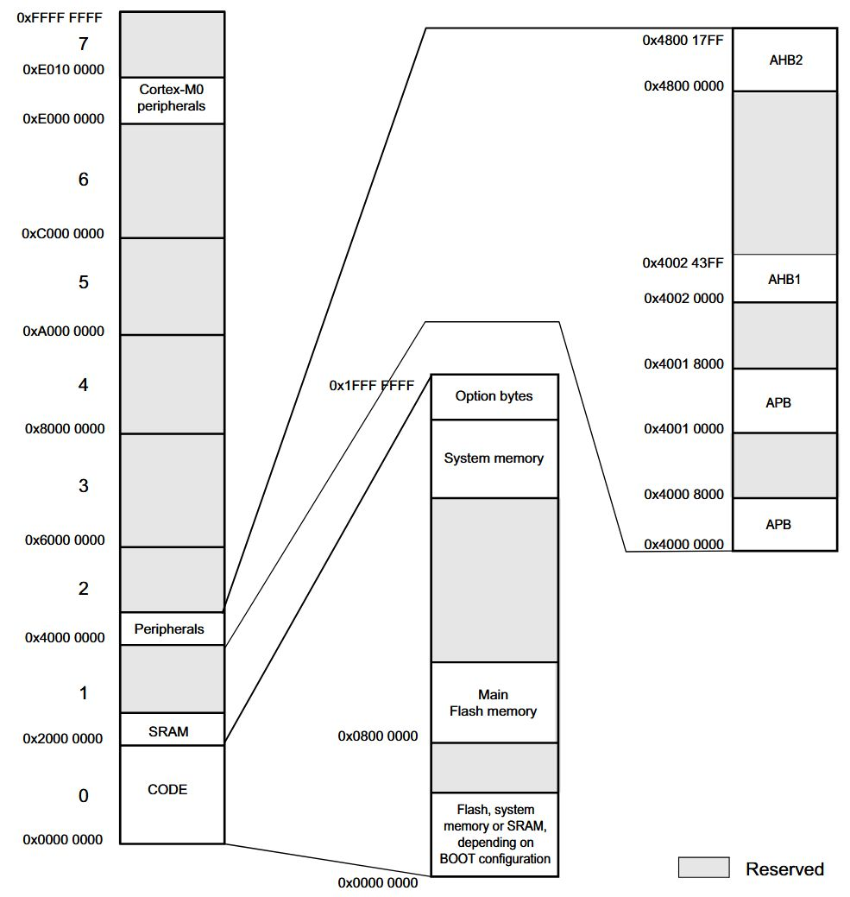{#fig-ch03-memory-map}

## GPIO Organization

On the STM32, a single GPIO peripheral can only control up to 16 pins. Since the STM32F091RC has far more pins than this, the microcontroller includes several copies of the GPIO peripheral, each controlling a different set of pins. Each copy of the GPIO peripheral is referred to as a **Port**, and each port is identified by a letter (A, B, C, and so on).

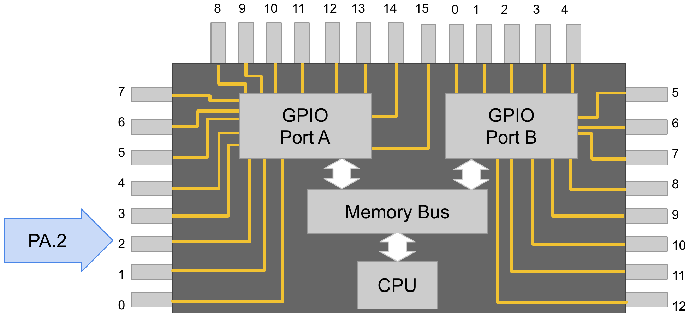{#fig-ch03-gpio-ports}

Individual pins on a port are identified by number, from 0 to 15. To refer to a specific pin, we use the notation **PXN**, where X is the port letter and N is the pin number. For example, "PA5" refers to Port A, Pin 5, and "PC13" refers to Port C, Pin 13.

### Which Pins are GPIO?

Not every pin on the microcontroller can be controlled by the GPIO peripheral; some pins are dedicated to power, ground, or the reset line. To determine which pins are available for GPIO, we consult the datasheet. The datasheet includes a pinout diagram of the chip's package, such as the one shown in @fig-ch03-pinout. Pins labeled with the PXN format, such as PA5 or PC13, are the ones controlled by GPIO. Many of these pins can also be shared with other peripherals, which we'll discuss further when we cover pin alternate functions in a later chapter.

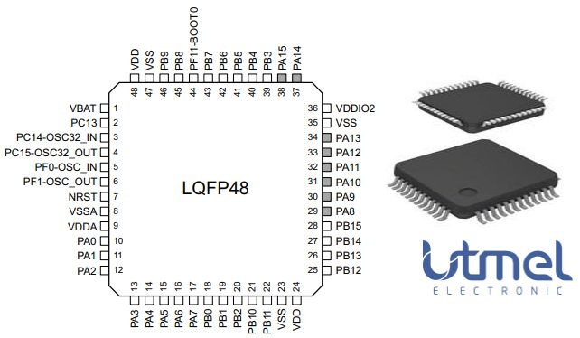{#fig-ch03-pinout}

### Dev Board Pinout

Since we're using a development board, the pins of the microcontroller's package have already been broken out to header pins along the edges of the board. The NUCLEO-F091RC's user manual includes diagrams, shown in @fig-ch03-devboard-pinout-left and @fig-ch03-devboard-pinout-right, that make it easy to identify which port and pin is connected to each header.

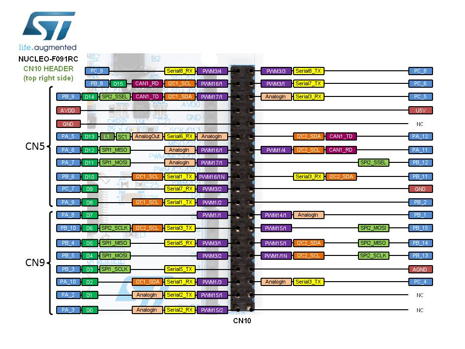{#fig-ch03-devboard-pinout-left}

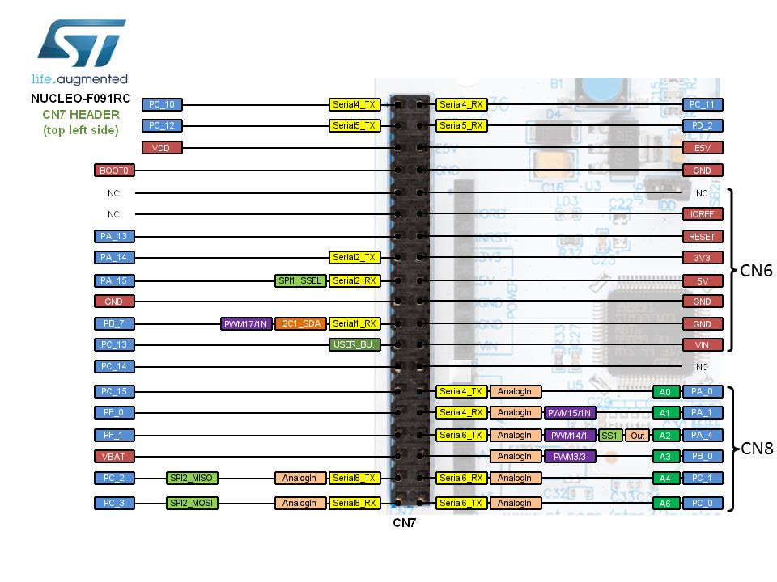{#fig-ch03-devboard-pinout-right}

## Controlling the GPIO

Now that we know the why and where of GPIO, let's discuss the how. Most microcontrollers' GPIO peripherals have four core registers used to control them:

Directional Register (`MODER`)
:   Configures a pin as an input or output

Output Register (`ODR`)
:   Sets the value of a pin configured as an output (high or low)

Input Register (`IDR`)
:   Reads the current value of a pin

Resistor Enable Register (`PUPDR`)
:   Enables a pull-up or pull-down resistor on an input pin

Let's walk through a complete example using each of these registers: blinking the green LED (LD2) built into the NUCLEO-F091RC.

## Example Application: Blink an LED

### Driving an LED with GPIO

The development board has an LED already connected to a GPIO pin. To find out which pin, we consult the development board's schematic in the UM1724 user manual, shown in @fig-ch03-led-schematic. From this, we can see that a green LED is connected to PA5.

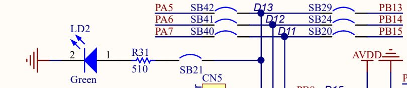{#fig-ch03-led-schematic}

### Enabling the Peripheral Clock

Before we can configure any of GPIOA's registers, there's an important STM32-specific step we must take: enabling the peripheral's clock. To conserve power, most peripherals on the STM32 are disabled by default and are not supplied with a clock signal until we explicitly enable them. This is controlled through the **Reset and Clock Control** (RCC) peripheral. Each GPIO port has a corresponding enable bit in the `RCC_AHBENR` register. GPIOA's clock enable bit is bit 17 (`IOPAEN`). If we forget this step, writes to GPIOA's registers will have no effect, since the peripheral isn't receiving a clock signal at all!

```c
volatile unsigned int* rcc_ahbenr = (unsigned int*) 0x40021014;
*rcc_ahbenr = 0x00020000; // Enable GPIOA (IOPAEN, bit 17)
```

### Setting the Mode

In order to set the voltage on a GPIO pin high, we must first configure that pin as an output. This is done using the mode register, `GPIOx_MODER`. From the reference manual, we can see that the mode register is 32 bits wide, and unlike a single enable bit, a *pair* of bits is used to configure the mode of each pin, as shown in @fig-ch03-moder.

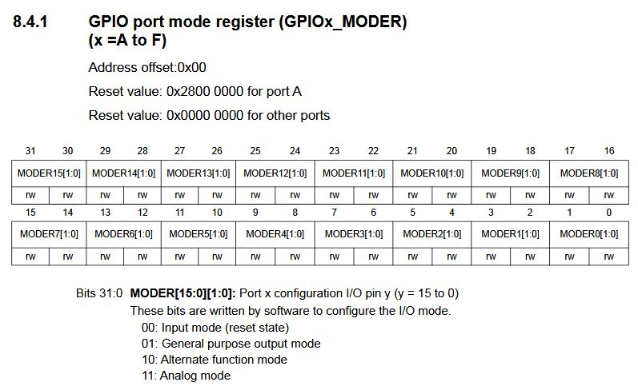{#fig-ch03-moder}

Each pin's two bits can be set to one of four values:

-   `00`: Input mode (the reset/default state)

-   `01`: General purpose output mode

-   `10`: Alternate function mode

-   `11`: Analog mode

For example, to set PA5 as an output, we need to write `01` to bits 11 and 10 (pin 5's field within the register):

```c
volatile unsigned int* gpioa_moder = (unsigned int*) 0x48000000;
*gpioa_moder = 0x00000400; // MODER5 = 01 -> bits [11:10]
```

::: {.callout-note}
Sometimes a pin is shared with another peripheral, such as a timer or an ADC. The GPIO peripheral acts as the "gatekeeper" for the pin and must be configured with the alternate function mode (`10`) to let those other peripherals' signals pass through to the pin.
:::

### Output Register

The output register, `GPIOx_ODR`, sets the value of each pin that has been configured as an output. Unlike the mode register, each bit in the output register corresponds to a single pin, as shown in @fig-ch03-odr. Writing a 1 sets the pin high, and writing a 0 sets it low.

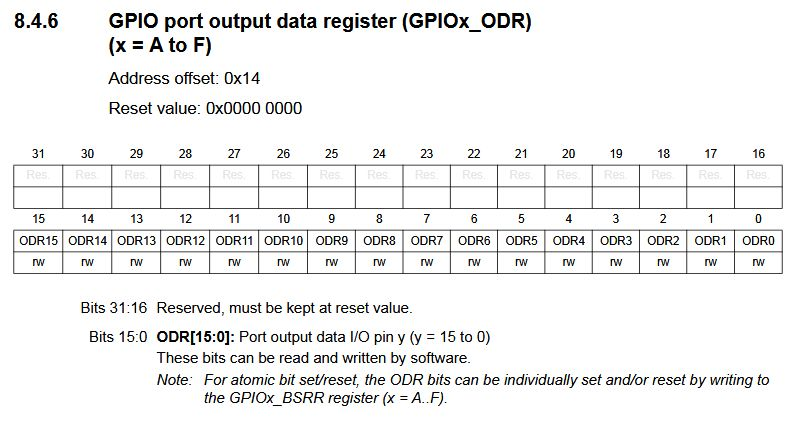{#fig-ch03-odr}

To write a high voltage to PA5, we need to write a 1 to bit 5 of the output register:

```c
volatile unsigned int* gpioa_odr = (unsigned int*) 0x48000014;
*gpioa_odr = 0x00000020; // ODR5 = 1 -> PA5 high
```

### The Bit Set/Reset Register

The STM32 also provides a second way to write to the output register: the bit set/reset register, `GPIOx_BSRR`. This register is split into two halves. Bits 15:0 (`BS`) set the corresponding output bit to 1, and bits 31:16 (`BR`) reset the corresponding output bit to 0. Writes to this register are atomic, meaning individual bits can be safely set or cleared without disturbing an interrupt that might be modifying other bits in `ODR` at the same time, something that isn't guaranteed when reading, modifying, and writing back the entire `ODR` register directly. We'll make use of `BSRR` again once we introduce interrupts later in this book.

### Accessing Registers

Now that we know which registers to use, how do we access them in C? Just as with any other memory-mapped location, we create a pointer to the register's address, then dereference that pointer to read or write its value.

```c
uint32_t* reg_p = (uint32_t*) 0x48000000;
*reg_p = 0x00000005;
```

### Finding the Register Address

In the reference manual, each register lists an **address offset**, indicating how far that register is from the GPIO port's **base address**. For example, `GPIOx_ODR` has an address offset of `0x14`.

To find the base address for a specific port, we consult the peripheral boundary address table in the reference manual, shown in @fig-ch03-peripheral-addrs.

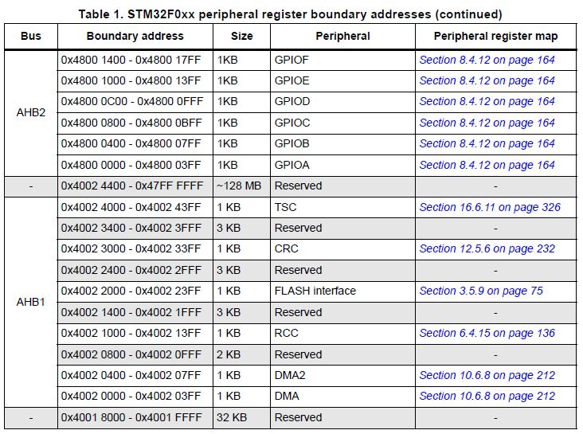{#fig-ch03-peripheral-addrs}

GPIOA's base address is `0x4800 0000`. Adding the `ODR` offset gives us the address of GPIOA's output register:

$$0\text{x}4800\ 0000 + 0\text{x}14 = 0\text{x}4800\ 0014$$

### The "volatile" Keyword

Notice that all our register pointers have been declared with the `volatile` keyword. The `volatile` keyword is a type qualifier that forces the compiler to generate an instruction for every access to that variable. The compiler's optimizer will often notice that some lines of embedded code appear to "do nothing" from an algorithmic perspective (nothing ever reads the variable we just wrote, as far as the compiler can tell) and will optimize those instructions out of the program entirely. Since we know these writes affect physical hardware, and not just program state, the `volatile` keyword prevents the compiler from making this mistake.

### Putting it Together

Combining everything we've covered, here is a complete program that blinks the green LED on the NUCLEO-F091RC:

```c
int main(void)
{
    // ---- Enable GPIOA clock ----
    volatile unsigned int* rcc_ahbenr = (unsigned int*)0x40021014;
    *rcc_ahbenr = 0x00020000; // Enable GPIOA (IOPAEN)

    // ---- GPIOA registers ----
    volatile unsigned int* gpioa_moder = (unsigned int*)0x48000000;
    volatile unsigned int* gpioa_odr   = (unsigned int*)0x48000014;

    // Set PA5 as output
    // MODER5 = 01 -> bits [11:10]
    *gpioa_moder = 0x00000400;

    volatile unsigned int i;
    while (1)
    {
        // LED ON (PA5 = 1)
        *gpioa_odr = 0x00000020;
        for (i = 0; i < 100000; i++) { }

        // LED OFF (PA5 = 0)
        *gpioa_odr = 0x00000000;
        for (i = 0; i < 100000; i++) { }
    }
}
```

This program will run indefinitely, blinking the LED on and off, until power is removed from the board. The `while(1)` loop is an infinite loop, and is found in nearly all embedded systems programs; we want our application to keep running so long as the device is powered, rather than terminate.

## Example Application: Read a Button Press

Let's apply what we've learned to a second example: reading the state of the on-board user button (B1) and using it to control the LED.

### Reading a Button Press with GPIO

Just as with the LED, we first need to identify which pin the button is connected to. Consulting the development board schematic, shown in @fig-ch03-button-schematic, we find that the button is connected to PC13. Note also that these buttons are "normally open," meaning the switch is open (not connected) when the button is not being pressed.

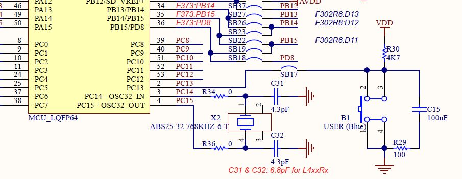{#fig-ch03-button-schematic}

### Configuring the GPIO as an Input

In order to read a voltage on a GPIO pin, we must:

-   Set the pin as an input (mode register)

-   Configure a pull-up resistor, if one doesn't already exist externally (resistor enable register)

-   Read the value of the pin (input data register)

Setting PC13 as an input requires writing `00` to its corresponding two-bit field in `GPIOC_MODER` (bits 27:26):

```c
volatile unsigned int* gpioc_moder = (unsigned int*) 0x48000800;
*gpioc_moder = 0x00000000; // MODER13 = 00 -> bits [27:26]
```

### Reading a Voltage

The input data register, `GPIOx_IDR`, is used to read a voltage. If the voltage on an input pin is high, a 1 will appear in the corresponding bit position of this register; if the voltage is low, a 0 will appear.

### Do We Need a Pull-Up Resistor?

If we look again at the schematic in @fig-ch03-button-schematic, we can see the board already includes a 4.7 kΩ pull-up resistor connected to the button. This means the pin will read a high voltage whenever the button isn't pressed, and a low voltage when it is pressed, without our needing to configure an internal pull-up resistor. @fig-ch03-pullup-present highlights this resistor on the schematic.

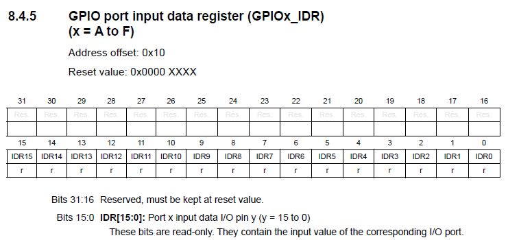{#fig-ch03-pullup-present}

### Internal Pull-Up and Pull-Down Resistors

It's worth noting, however, that many circuits don't have the luxury of an external pull-up or pull-down resistor already in place. Because these resistors are so commonly needed (any switch or open-drain output requires one), most GPIO peripherals, including the STM32's, allow us to configure an *internal* resistor instead, saving us from having to add external hardware. @fig-ch03-internal-pullup shows a simplified illustration of how this internal resistor is wired into the GPIO hardware.

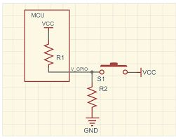{#fig-ch03-internal-pullup}

This internal resistor is configured using the `GPIOx_PUPDR` register, shown in @fig-ch03-pupdr. Just like the mode register, two bits are used to configure each pin:

-   `00`: No pull-up or pull-down

-   `01`: Pull-up

-   `10`: Pull-down

-   `11`: Reserved

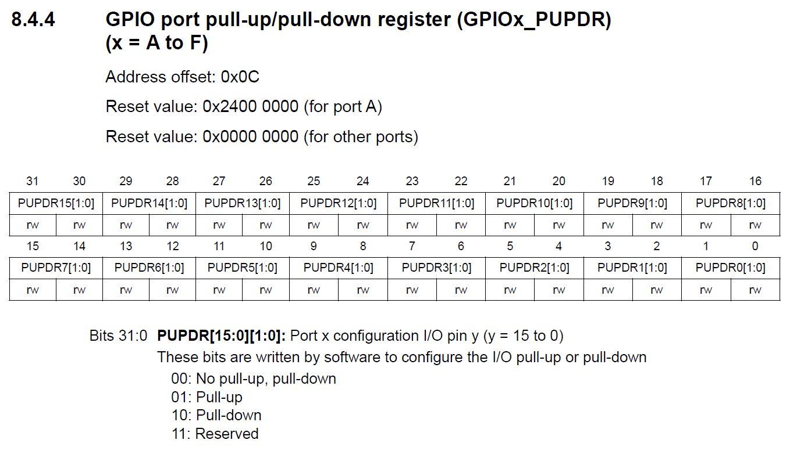{#fig-ch03-pupdr}

Since our button already has an external pull-up, we'll leave `PUPDR` at its reset value (`00`, no internal resistor) for this example.

### Putting it Together

Here's a complete program that reads the state of the button on PC13 and turns the LED on PA5 on when it is pressed:

```c
int main(void){
    // Enable GPIOA + GPIOC clocks (RCC_AHBENR)
    volatile unsigned int* rcc_ahbenr = (unsigned int*)0x40021014;
    *rcc_ahbenr = 0x00080000 | 0x00020000; // IOPCEN (bit 19) + IOPAEN (bit 17)

    // GPIOA registers (LED on PA5)
    volatile unsigned int* gpioa_moder = (unsigned int*)0x48000000;
    volatile unsigned int* gpioa_odr   = (unsigned int*)0x48000014;

    // GPIOC registers (Button on PC13)
    volatile unsigned int* gpioc_moder = (unsigned int*)0x48000800;
    volatile unsigned int* gpioc_idr   = (unsigned int*)0x48000810;

    // ---- Configure PA5 as output (MODER5 = 01 -> bits [11:10]) ----
    *gpioa_moder = 0x00000400;

    // ---- Configure PC13 as input (MODER13 = 00 -> bits [27:26]) ----
    *gpioc_moder = 0x00000000;

    // Initialize LED OFF (PA5 = 0)
    *gpioa_odr = 0x00000000;

    while(1){
        // If the button reads 0, turn the LED on.
        if(*gpioc_idr == 0x00000000){
            *gpioa_odr = 0x00000020; // PA5 high
        } else {
            *gpioa_odr = 0x00000000; // PA5 low
        }
    }
}
```

This code will run until power is removed, constantly checking the button and setting the LED accordingly.

## GPIO Hardware

Let's take a moment to observe how the control registers we've discussed create the hardware behavior we've described. @fig-ch03-hw-schematic shows a simplified schematic of the internals of the GPIO peripheral hardware.

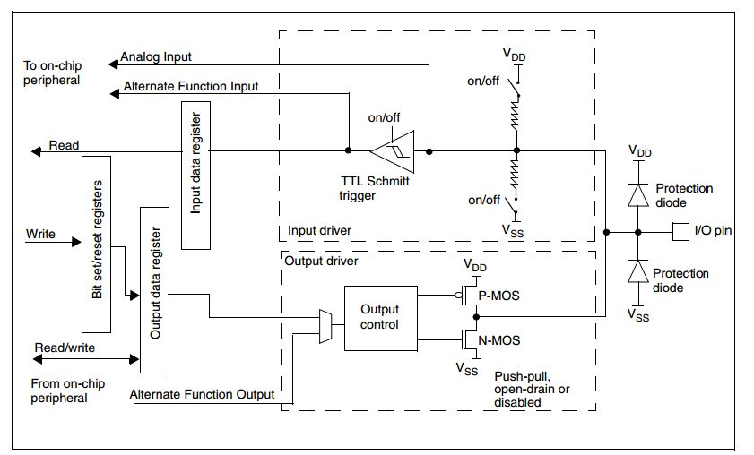{#fig-ch03-hw-schematic}

On the output side, the bit set/reset registers and output data register feed into an output control block, which drives the pin using a push-pull or open-drain configuration, depending on how the pin has been configured. On the input side, a Schmitt trigger reads the voltage on the pin and stores a 1 or 0 into the input data register, which our program can then read.

## Register Macros

Using pointers, we can write to any register we need and have total control over the hardware. However, it's tedious to create a pointer and dereference it every time we want to access a peripheral. We can condense this using preprocessor macros.

Preprocessor macros are lines of code that begin with a "#" symbol. These lines get replaced with actual C syntax by the preprocessor before the compiler runs, according to what the macro defines. We can use the `#define` directive to create macros that expand into dereferenced pointers:

```c
#define GPIOA_MODER *((unsigned int*) 0x48000000)
#define GPIOA_ODR   *((unsigned int*) 0x48000014)
#define GPIOC_MODER *((unsigned int*) 0x48000800)
#define GPIOC_IDR   *((unsigned int*) 0x48000810)
#define RCC_AHBENR  *((unsigned int*) 0x40021014)
```

The preprocessor will replace every instance of `GPIOA_ODR` in our code with `*((unsigned int*) 0x48000014)`, letting us both read and write the register just by using its name. Let's update our button/LED example to use these macros:

```c
#define RCC_AHBENR  *((unsigned int*) 0x40021014)
#define GPIOA_MODER *((unsigned int*) 0x48000000)
#define GPIOA_ODR   *((unsigned int*) 0x48000014)
#define GPIOC_MODER *((unsigned int*) 0x48000800)
#define GPIOC_IDR   *((unsigned int*) 0x48000810)

int main(void){
    // Enable GPIOA (bit 17) and GPIOC (bit 19) clocks
    RCC_AHBENR = 0x00020000 | 0x00080000;

    // ---- Configure PA5 as output ----
    GPIOA_MODER = 0x00000400;

    // ---- Configure PC13 as input ----
    GPIOC_MODER = 0x00000000;

    // Turn LED OFF initially
    GPIOA_ODR = 0x00000000;

    while(1){
        if(GPIOC_IDR == 0x00000000){
            GPIOA_ODR = 0x00000020; // PA5 = 1 (LED ON)
        } else {
            GPIOA_ODR = 0x00000000; // PA5 = 0 (LED OFF)
        }
    }
}
```

Manufacturers understand this need quite well, and to make their products more attractive to programmers, they typically provide a header file with these macros already defined for every register on the chip. For the STM32, this comes in the form of a CMSIS-style device header, `stm32f0xx.h`, which groups each peripheral's registers into a C `struct`, accessed through a pointer named after the peripheral:

```c
#include "stm32f0xx.h"

int main(void){
    // Enable GPIOA (bit 17) and GPIOC (bit 19) clocks
    RCC->AHBENR = 0x00020000 | 0x00080000;

    // ---- Configure PA5 as output ----
    GPIOA->MODER = 0x00000400;

    // ---- Configure PC13 as input ----
    GPIOC->MODER = 0x00000000;

    // Turn LED OFF initially
    GPIOA->ODR = 0x00000000;

    while(1){
        if(GPIOC->IDR == 0x00000000){
            GPIOA->ODR = 0x00000020; // PA5 high
        } else {
            GPIOA->ODR = 0x00000000; // PA5 low
        }
    }
}
```

By including `"stm32f0xx.h"`, we gain access to `GPIOA`, `GPIOC`, and `RCC`, each already pointing to the correct base address for our target device, along with named fields (`MODER`, `ODR`, `IDR`, etc.) for every register they contain.

## Bit Masking

When manipulating individual bits in a control register, one of our biggest concerns is being able to read from and write to individual bits without disturbing the others. Since memory is divided into byte-addressable (or larger) locations, we can't read or write a single bit in isolation; we always have to operate on the entire register. To isolate a single bit (or a handful of bits), we use a **bit mask**.

### Understanding the Problem

Consider our earlier example, where we checked the entire input register to see if the button was pressed:

```c
if(GPIOC->IDR == 0x00000000){ /* ... */ }
```

This only works because PC13 is the only pin we care about on GPIOC. If another input, say a second button on PC2, were also being read, and it happened to be high, `GPIOC->IDR` would no longer equal `0x00000000` even when our button of interest was pressed. We need a way to check the state of bit 13 alone, ignoring every other bit in the register.

### Creating a Bit Mask

A bit mask is a binary value constructed so that, when combined with another value using a bitwise operator, it isolates, sets, or clears specific bits while leaving the rest untouched. @fig-ch03-bitmask-and illustrates how a bitwise AND operation with a mask isolates a single bit, zeroing out every other bit in the result.

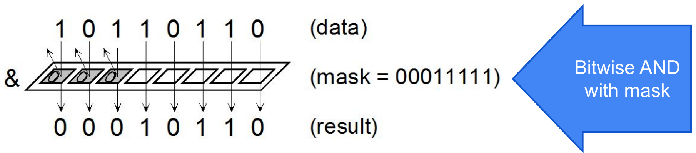{#fig-ch03-bitmask-and}

To check only bit 13 of `GPIOC->IDR`, we construct a mask with a single 1 in the bit 13 position (`0x00002000`) and apply it with a bitwise AND:

```c
if((GPIOC->IDR & 0x00002000) == 0x00000000){
    // button is pressed
}
```

### Bit Masking for Setting and Clearing Bits

We can use a similar approach to set or clear individual bits without disturbing the rest of a register. To *set* a bit, we use the bitwise OR operator (`|`) with a mask containing a 1 in the position we want to set:

```c
GPIOA->ODR = GPIOA->ODR | 0x00000020; // set PA5, leave other bits alone
```

To *clear* a bit, we use the bitwise AND operator with the *inverse* of our mask, which places a 0 in the position we want to clear and 1's everywhere else:

```c
GPIOA->ODR = GPIOA->ODR & ~(0x00000020); // clear PA5, leave other bits alone
```

C provides shorthand assignment operators for both of these operations:

```c
GPIOA->ODR |= 0x00000020;    // equivalent to: GPIOA->ODR = GPIOA->ODR | 0x00000020;
GPIOA->ODR &= ~(0x00000020); // equivalent to: GPIOA->ODR = GPIOA->ODR & ~(0x00000020);
```

### Creating Readable Masks with the Shift Operator

Hand-writing hex masks like `0x00000020` makes it difficult to tell, at a glance, which bit is being targeted. We can improve readability by using the left-shift operator (`<<`) to construct the mask instead:

```c
GPIOA->ODR |= (1u << 5);     // set PA5
GPIOA->ODR &= ~(1u << 5);    // clear PA5
```

The `1u << 5` expression takes the value `1` and shifts it left five times, landing a single 1 bit in position 5. This is functionally identical to writing `0x00000020`, but immediately communicates which pin we're targeting. Most compilers will recognize this as a constant expression and generate the same code as if we had hardcoded the value; we get the readability improvement without any runtime cost.

### Masking Registers with Paired Values

Recall that some STM32 registers, like `MODER` and `PUPDR`, use two bits per pin rather than one. This introduces a subtlety that we didn't encounter with single-bit registers like `ODR`. Suppose we want to set PC4 as an output by writing `01` to bits 9:8 of `GPIOC->MODER`:

```c
GPIOC->MODER |= (0x1u << 8); // NOT guaranteed to work correctly!
```

Using only an OR here is *not* safe. If bit 9 already happened to contain a 1 (perhaps left over from a different mode), the OR operation would leave it set, resulting in an unintended mode such as `11` (analog) rather than the `01` (output) we wanted. Since OR can only set bits, never clear them, we must first clear both bits in the field before setting the ones we want:

```c
GPIOC->MODER &= ~(0x3u << (4 * 2)); // clear bits [9:8]
GPIOC->MODER |= (0x1u << (4 * 2));  // set to 01 (output)
```

Here, `0x3u` (`0b11`) is used as the clearing mask, since it spans both bits of the two-bit field, and `4 * 2` computes the starting bit position for pin 4's field (each pin occupies 2 bits, so pin *N*'s field begins at bit `N * 2`). This two-step clear-then-set pattern is required any time we're working with a multi-bit field, and you'll use it constantly when configuring `MODER` and `PUPDR`.

## Additional Notes

A few practical considerations are worth keeping in mind as you begin writing your own GPIO applications.

### Polling for Inputs

In our button example, our `while(1)` loop constantly re-checks the state of the button on every iteration. This technique is called **polling**. Polling is simple to implement, but it should only be used for inputs that don't need to be responded to immediately or that don't change very frequently. If we need to respond to an input the instant it changes, or if checking that input is too costly to do constantly, we'll need to use an **interrupt** instead, which we will cover in a later chapter.

### Button Debouncing

When a mechanical button is pressed, the signal often "bounces" between high and low several times over a very short period before settling, due to the physical contacts inside the switch. If read naively, this can cause our program to register several presses instead of one. A short delay inserted after detecting the first change in the button's state is a simple way to filter out this bouncing; the appropriate delay length varies by switch and is often determined empirically.

## Recap

In this chapter we've learned:

-   How peripherals let a microcontroller interface with the outside world

-   Where to find the documentation for a development board, a microcontroller family, and a specific microcontroller

-   How to control peripherals by writing to memory-mapped control registers

-   How to configure and use the STM32 GPIO peripheral's `MODER`, `ODR`, `IDR`, `PUPDR`, and `BSRR` registers

-   Why STM32 peripherals require their clock to be enabled through the RCC before they can be used

-   How to use pointers, preprocessor macros, and the vendor-provided device header to access control registers

-   How to use bit masking to isolate, set, and clear individual bits (or multi-bit fields) without disturbing the rest of a register
